## **Summary**
The goal of this data project was to predict survival of passengers on the Titanic by building an algorithm using raw training data of 891 observations that consisted of a dependent variable, an id variable, and 10 features. The specifics of each variable are listed below: 

+ PassengerId: identifies passengers
+ Survived: 0 = non-survivor, 1 = survivor
+ Pclass: ticket class; 1 = lower, 2 = middle, 3 = upper
+ Name: name of passenger
+ Sex: male or female
+ Age: age of passenger
+ SibSp: number of siblings and spouse of passenger aboard the Titanic
+ Parch: number of parents and children of passenger aboard the Titanic
+ Ticket: ticket number of passenger
+ Fare: cost of passenger's ticket
+ Cabin: cabin of passenger
+ Embarked: location that passenger boarded the Titanic; S = Southampton, Q = Queenstown, C = Cherbourg

The data were cleaned, wrangled, and tidied, and explored through visualization. Additional features were engineered from the raw data. The final, tidy dataset was split for cross-validaiton. Two models--a logistic regression model and a support-vector machine--were fit to the data, assessed on the cross-validation samples, and the hyperparameters of the support-vector machine were tuned. The logistic regression model had higher accuracy on the cross-validation set and thus was assessed with the test dataset. It was 76.8% accurate in predicting survival of passengers from these data. 
\
\

## **Preprocessing Data**
### Load packages and data
The relevant packages for preprocessing data were loaded. The csv file for the training dataset was read into R using read_csv() from the readr package.

```r
#load packages
library(here)
library(readr)
library(visdat)
library(dplyr)
library(skimr)
library(janitor)
library(forcats)
library(recipes)
library(ggplot2)
library(stringr)

#import data
titanic<-read_csv(here("data","raw_data","train.csv"),
                  col_types="iffcfniicncf")
```
The col_types argument matches the data types in the csv file (e.g., i=integer, f=factor, c=character, n=number).
\
\

### Preliminary data check
The titanic tibble was checked for the correct numbers of rows and columns and appropriate column classes as well as for any irregularities.

```r
#preliminary data checking
nrow(titanic); ncol(titanic) #check # of rows/cols
```

```
## [1] 891
```

```
## [1] 12
```

```r
glimpse(titanic) #check classes of variables
```

```
## Rows: 891
## Columns: 12
## $ PassengerId <int> 1, 2, 3, 4, 5, 6, 7, 8, 9, 10, 11, 12, 13, 14, 15, 16, 17…
## $ Survived    <fct> 0, 1, 1, 1, 0, 0, 0, 0, 1, 1, 1, 1, 0, 0, 0, 1, 0, 1, 0, …
## $ Pclass      <fct> 3, 1, 3, 1, 3, 3, 1, 3, 3, 2, 3, 1, 3, 3, 3, 2, 3, 2, 3, …
## $ Name        <chr> "Braund, Mr. Owen Harris", "Cumings, Mrs. John Bradley (F…
## $ Sex         <fct> male, female, female, female, male, male, male, male, fem…
## $ Age         <dbl> 22, 38, 26, 35, 35, NA, 54, 2, 27, 14, 4, 58, 20, 39, 14,…
## $ SibSp       <int> 1, 1, 0, 1, 0, 0, 0, 3, 0, 1, 1, 0, 0, 1, 0, 0, 4, 0, 1, …
## $ Parch       <int> 0, 0, 0, 0, 0, 0, 0, 1, 2, 0, 1, 0, 0, 5, 0, 0, 1, 0, 0, …
## $ Ticket      <chr> "A/5 21171", "PC 17599", "STON/O2. 3101282", "113803", "3…
## $ Fare        <dbl> 7.2500, 71.2833, 7.9250, 53.1000, 8.0500, 8.4583, 51.8625…
## $ Cabin       <chr> NA, "C85", NA, "C123", NA, NA, "E46", NA, NA, NA, "G6", "…
## $ Embarked    <fct> S, C, S, S, S, Q, S, S, S, C, S, S, S, S, S, S, Q, S, S, …
```

```r
head(titanic,n=10); tail(titanic,n=10) #check top/bottom of tibble
```

```
## # A tibble: 10 x 12
##    PassengerId Survived Pclass Name  Sex     Age SibSp Parch Ticket  Fare Cabin
##          <int> <fct>    <fct>  <chr> <fct> <dbl> <int> <int> <chr>  <dbl> <chr>
##  1           1 0        3      Brau… male     22     1     0 A/5 2…  7.25 <NA> 
##  2           2 1        1      Cumi… fema…    38     1     0 PC 17… 71.3  C85  
##  3           3 1        3      Heik… fema…    26     0     0 STON/…  7.92 <NA> 
##  4           4 1        1      Futr… fema…    35     1     0 113803 53.1  C123 
##  5           5 0        3      Alle… male     35     0     0 373450  8.05 <NA> 
##  6           6 0        3      Mora… male     NA     0     0 330877  8.46 <NA> 
##  7           7 0        1      McCa… male     54     0     0 17463  51.9  E46  
##  8           8 0        3      Pals… male      2     3     1 349909 21.1  <NA> 
##  9           9 1        3      John… fema…    27     0     2 347742 11.1  <NA> 
## 10          10 1        2      Nass… fema…    14     1     0 237736 30.1  <NA> 
## # … with 1 more variable: Embarked <fct>
```

```
## # A tibble: 10 x 12
##    PassengerId Survived Pclass Name  Sex     Age SibSp Parch Ticket  Fare Cabin
##          <int> <fct>    <fct>  <chr> <fct> <dbl> <int> <int> <chr>  <dbl> <chr>
##  1         882 0        3      "Mar… male     33     0     0 349257  7.90 <NA> 
##  2         883 0        3      "Dah… fema…    22     0     0 7552   10.5  <NA> 
##  3         884 0        2      "Ban… male     28     0     0 C.A./… 10.5  <NA> 
##  4         885 0        3      "Sut… male     25     0     0 SOTON…  7.05 <NA> 
##  5         886 0        3      "Ric… fema…    39     0     5 382652 29.1  <NA> 
##  6         887 0        2      "Mon… male     27     0     0 211536 13    <NA> 
##  7         888 1        1      "Gra… fema…    19     0     0 112053 30    B42  
##  8         889 0        3      "Joh… fema…    NA     1     2 W./C.… 23.4  <NA> 
##  9         890 1        1      "Beh… male     26     0     0 111369 30    C148 
## 10         891 0        3      "Doo… male     32     0     0 370376  7.75 <NA> 
## # … with 1 more variable: Embarked <fct>
```
The tibble is 891 (rows; observations) x 12 (columns; variables), which is correct. The column classes are accurate. The data previews show that there are missing data, particularly in the Cabin column.
\
\

### Data cleaning
The names and order of the columns were changed, and the levels of the pclass factor were re-ordered.

```r
titanic<-clean_names(titanic) #clean names
titanic<-relocate(titanic,survived,before=passenger_id) #rearranges cols
levels(titanic$pclass) #not in numerical order
```

```
## [1] "3" "1" "2"
```

```r
titanic$pclass<-fct_relevel(titanic$pclass,c("1","2","3"))
levels(titanic$pclass)
```

```
## [1] "1" "2" "3"
```
Now the pclass levels are in numerical order.
\
\

### Data imputation
Missing data were assessed visually. 

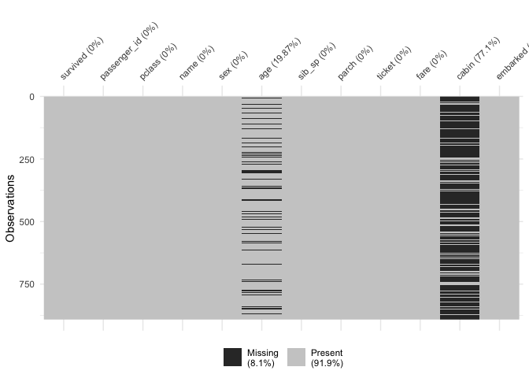<!-- -->

Three columns had missing data: cabin (~77% missing), age (~20%), and embarked (2 observations). Given that cabin location intuitively may be related to passenger survival of the Titanic disaster, the variable was kept, and the NAs were recoded as "unknown_other." Age and embarked missing data were imputed using a k-nearest neighbor algorithm via the functions recipe, prep, and bake from the recipes package. 

```r
#impute data
titanic$cabin[is.na(titanic$cabin)]<-"unknown_other" #replace NAs with unknown_other
imputed<-recipe(survived~pclass + sex + age + sib_sp + parch + fare + embarked,data=titanic) %>%
  step_knnimpute(age,embarked,fare,neighbors=10) #via k-nearest neighbors
saveRDS(imputed,here("data","tidy_data","imputed_data_recipe"))
i_titanic<-prep(imputed) %>% bake(new_data=titanic)
sum(is.na(i_titanic)) #no missing data
```

```
## [1] 0
```
Now, there are no missing data in cabin, age, and embarked.
\

The i_titanic columns were combined with survived, passenger_id, and the three character variables: name, ticket, and cabin.

```r
c_titanic<-bind_cols(titanic[,c(1,2)],i_titanic[,1:7],titanic[,c(4,9,11)])
```
\
\

### Data check
More thorough data checking was performed following imputation to see if values for select columns made sense and if they were corroborated by external sources.

```r
#check n's (using prior knowledge)
range(c_titanic$age,na.rm=T) #0.42-80
```

```
## [1]  0.42 80.00
```

```r
range(c_titanic$fare,na.rm=T) #0-512
```

```
## [1]   0.0000 512.3292
```

```r
range(c_titanic$sib_sp) #0-8
```

```
## [1] 0 8
```

```r
range(c_titanic$parch) #0-6
```

```
## [1] 0 6
```

```r
#all seem reasonable

#validate with external data
#from wiki: 24.6% 1st class; 21.5% 2nd class; and 53.8% 3rd class
tabyl(c_titanic,pclass) #24.2%, 20.7%, and 55.1% (seem close)
```

```
##  pclass   n   percent
##       1 216 0.2424242
##       2 184 0.2065095
##       3 491 0.5510662
```

```r
#from wiki: 66% male and 34% female
tabyl(c_titanic,sex) #64.7% m and 35.2% f (again, close)
```

```
##     sex   n  percent
##    male 577 0.647587
##  female 314 0.352413
```
The values for age, fare, sib_sp, and parch seemed reasonable (e.g., no negative ages). The distribution of pclasses and sexes were similar to the numbers reported on wikipedia.
\
\

### Feature engineering
Four features were extracted from the training data to help develop a predictive model. 
\
\

#### Cabin
First, cabin_type was engineered from cabin due to its logical predictive ability as well as the diversity of cabins aboard the Titanic.

```r
#cabin: code as factor
length(unique(c_titanic$cabin)) #148 different cabin types
```

```
## [1] 148
```

```r
unique(c_titanic$cabin)[1:15] #overlapping prefixes (which indicate cabin & possibly survival)
```

```
##  [1] "unknown_other" "C85"           "C123"          "E46"          
##  [5] "G6"            "C103"          "D56"           "A6"           
##  [9] "C23 C25 C27"   "B78"           "D33"           "B30"          
## [13] "C52"           "B28"           "C83"
```
There were 148 unique cabin values and apparent overlap in the alpha prefix for these values. Thus, cabin values were binned into categories by letter prefix (see Appendix for code), and categories with low numbers (<=12) were added to "unknown_other" along with the NAs in the raw data. The variable cabin_type was converted to a factor. The resultant numbers of cabin_type levels based on survival are shown below.


```
##  survived A  B  C  D  E F  UO
##         0 8 12 24  8  8 5 484
##         1 7 35 35 25 24 8 208
```
\
\

#### Tickets
The character variable ticket was also engineered as it contained numerous unique values and could potentially be associated with survival.

```r
length(unique(c_titanic$ticket)) #681 different types
```

```
## [1] 681
```

```r
sum(str_detect(c_titanic$ticket,"\\D")) #230 have at least one letter
```

```
## [1] 230
```
Specifically, the training data contained 681 unique tickets, and 230 tickets had at least one letter. The rest were completely numeric.
\
\

Similar to the cabin variable, the ticket variable was binned by letter prefix for alphanumeric ticket values, and the numeric tickets were categorized by value (e.g., <10000, 10000-100000) as these seemed to be associated the best with survival (see Appendix for code and some output).

Following feature engineering, ticket was renamed ticket_cat, reclassified as a factor, and had 13 levels. Their relationships with survival are illustrated below.

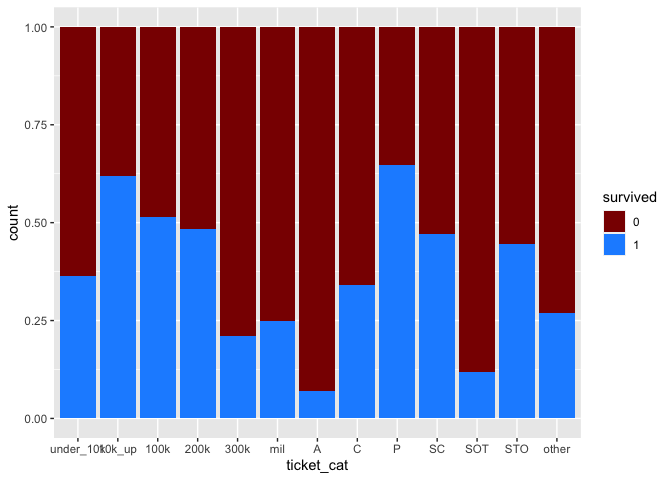<!-- -->

This figure shows variability in survival by ticket_cat.
\
\

#### Marital Status
Marital status of women could be deduced from the name variable. Thus, this was explored as a possible feature. Women were binned into one of three categories--married, unmarried, or unknown marital status--based on title and presence/absence of a maiden name (see Appendix for code). Men's marital status could not be confidently and easily identified by name alone. Therefore, male marital status was considered unknown and combined with women with unknown marital status. As a result, the new feature marital_status had three categories: unk_na (male and unknown female), Fm (married female), and Fum (unmarried female). Below are the relationships between the new feature and survival.


```
##  survived  Fm Fum unk_na
##         0  26  55    468
##         1 101 129    112
```
Married women survived the Titanic disaster at a 4:1 ratio, while unmarried women survived at roughly 2.5:1. 
\
\

#### Family Size
The two variables realted to family size--sib_sp and parch--were explored.

```r
tabyl(c_titanic,sib_sp)
```

```
##  sib_sp   n     percent
##       0 608 0.682379349
##       1 209 0.234567901
##       2  28 0.031425365
##       3  16 0.017957351
##       4  18 0.020202020
##       5   5 0.005611672
##       8   7 0.007856341
```

```r
tabyl(c_titanic,parch)
```

```
##  parch   n     percent
##      0 678 0.760942761
##      1 118 0.132435466
##      2  80 0.089786756
##      3   5 0.005611672
##      4   4 0.004489338
##      5   5 0.005611672
##      6   1 0.001122334
```

```r
c_titanic %>% mutate(fam_size=parch+sib_sp) %>% tabyl(fam_size,survived)
```

```
##  fam_size   0   1
##         0 374 163
##         1  72  89
##         2  43  59
##         3   8  21
##         4  12   3
##         5  19   3
##         6   8   4
##         7   6   0
##        10   7   0
```
These tables indicate that most Titanic passengers traveled without family, and that larger families (4+ individuals) were uncommon, potentially confounding results due to paucity of higher sib_sp and parch values. Thus, these two variables were combined into a new feature, fam_size (family size), and converted to a factor with three levels: solo (fam_size=0), small (1-3), and large (4+). The relationship between family size and survival was explored.


```
##  fam_size   0   1
##      solo 374 163
##     small 123 169
##     large  52  10
```
Survival tends to decrease with increasing family size.
\
\

### Feature Selection and Data Saving
Following data preprocessing, variables of interest were selected for exploratory data analysis and saved as a csv file.

```r
#remove unnecessary columns and convert to f_titanic
f_titanic<-c_titanic[,-c(6:7,10:12)] #remove sib_sp, parch, name, ticket, and cabin

#explort tibble as a .csv
write_csv(f_titanic,here("data","tidy_data","tidy_train.csv"))
```
\
\

## **Exploratory Data Analysis**
### Load packages and data
Relevant packages for exploratory data analysis were loaded into R. The data were read into R, and columns (variables) were classified appropriately.

```r
#load packages
library(readr)
library(here)
library(skimr)
library(dplyr)
library(ggplot2)
library(cowplot)
library(knitr)
library(kableExtra)
library(janitor)

#import cleaned and tidied data as a .csv to a tibble
f_titanic<-read_csv(here("data","tidy_data","tidy_train.csv"),
         col_types="fiffnnfffff")
```
\
\

### Summary statistics and correlations
Summary statistics were explored for each variable.

```r
summary(f_titanic)
```

```
##  survived  passenger_id   pclass      sex           age             fare       
##  0:549    Min.   :  1.0   3:491   male  :577   Min.   : 0.42   Min.   :  0.00  
##  1:342    1st Qu.:223.5   1:216   female:314   1st Qu.:21.00   1st Qu.:  7.91  
##           Median :446.0   2:184                Median :28.65   Median : 14.45  
##           Mean   :446.0                        Mean   :29.76   Mean   : 32.20  
##           3rd Qu.:668.5                        3rd Qu.:37.30   3rd Qu.: 31.00  
##           Max.   :891.0                        Max.   :80.00   Max.   :512.33  
##                                                                                
##  embarked cabin_type     ticket_cat  marital_status  fam_size  
##  S:644    UO:692     300k     :256   unk_na:580     small:292  
##  C:170    C : 59     10k_up   :131   Fm    :127     solo :537  
##  Q: 77    E : 32     under_10k: 99   Fum   :184     large: 62  
##           D : 33     200k     : 87                             
##           A : 15     100k     : 72                             
##           B : 47     P        : 65                             
##           F : 13     (Other)  :181
```

```r
skim(f_titanic) 
```


<table style='width: auto;'
        class='table table-condensed'>
<caption>Data summary</caption>
 <thead>
  <tr>
   <th style="text-align:left;">   </th>
   <th style="text-align:left;">   </th>
  </tr>
 </thead>
<tbody>
  <tr>
   <td style="text-align:left;"> Name </td>
   <td style="text-align:left;"> f_titanic </td>
  </tr>
  <tr>
   <td style="text-align:left;"> Number of rows </td>
   <td style="text-align:left;"> 891 </td>
  </tr>
  <tr>
   <td style="text-align:left;"> Number of columns </td>
   <td style="text-align:left;"> 11 </td>
  </tr>
  <tr>
   <td style="text-align:left;"> _______________________ </td>
   <td style="text-align:left;">  </td>
  </tr>
  <tr>
   <td style="text-align:left;"> Column type frequency: </td>
   <td style="text-align:left;">  </td>
  </tr>
  <tr>
   <td style="text-align:left;"> factor </td>
   <td style="text-align:left;"> 8 </td>
  </tr>
  <tr>
   <td style="text-align:left;"> numeric </td>
   <td style="text-align:left;"> 3 </td>
  </tr>
  <tr>
   <td style="text-align:left;"> ________________________ </td>
   <td style="text-align:left;">  </td>
  </tr>
  <tr>
   <td style="text-align:left;"> Group variables </td>
   <td style="text-align:left;">  </td>
  </tr>
</tbody>
</table>


**Variable type: factor**

<table>
 <thead>
  <tr>
   <th style="text-align:left;"> skim_variable </th>
   <th style="text-align:right;"> n_missing </th>
   <th style="text-align:right;"> complete_rate </th>
   <th style="text-align:left;"> ordered </th>
   <th style="text-align:right;"> n_unique </th>
   <th style="text-align:left;"> top_counts </th>
  </tr>
 </thead>
<tbody>
  <tr>
   <td style="text-align:left;"> survived </td>
   <td style="text-align:right;"> 0 </td>
   <td style="text-align:right;"> 1 </td>
   <td style="text-align:left;"> FALSE </td>
   <td style="text-align:right;"> 2 </td>
   <td style="text-align:left;"> 0: 549, 1: 342 </td>
  </tr>
  <tr>
   <td style="text-align:left;"> pclass </td>
   <td style="text-align:right;"> 0 </td>
   <td style="text-align:right;"> 1 </td>
   <td style="text-align:left;"> FALSE </td>
   <td style="text-align:right;"> 3 </td>
   <td style="text-align:left;"> 3: 491, 1: 216, 2: 184 </td>
  </tr>
  <tr>
   <td style="text-align:left;"> sex </td>
   <td style="text-align:right;"> 0 </td>
   <td style="text-align:right;"> 1 </td>
   <td style="text-align:left;"> FALSE </td>
   <td style="text-align:right;"> 2 </td>
   <td style="text-align:left;"> mal: 577, fem: 314 </td>
  </tr>
  <tr>
   <td style="text-align:left;"> embarked </td>
   <td style="text-align:right;"> 0 </td>
   <td style="text-align:right;"> 1 </td>
   <td style="text-align:left;"> FALSE </td>
   <td style="text-align:right;"> 3 </td>
   <td style="text-align:left;"> S: 644, C: 170, Q: 77 </td>
  </tr>
  <tr>
   <td style="text-align:left;"> cabin_type </td>
   <td style="text-align:right;"> 0 </td>
   <td style="text-align:right;"> 1 </td>
   <td style="text-align:left;"> FALSE </td>
   <td style="text-align:right;"> 7 </td>
   <td style="text-align:left;"> UO: 692, C: 59, B: 47, D: 33 </td>
  </tr>
  <tr>
   <td style="text-align:left;"> ticket_cat </td>
   <td style="text-align:right;"> 0 </td>
   <td style="text-align:right;"> 1 </td>
   <td style="text-align:left;"> FALSE </td>
   <td style="text-align:right;"> 13 </td>
   <td style="text-align:left;"> 300: 256, 10k: 131, und: 99, 200: 87 </td>
  </tr>
  <tr>
   <td style="text-align:left;"> marital_status </td>
   <td style="text-align:right;"> 0 </td>
   <td style="text-align:right;"> 1 </td>
   <td style="text-align:left;"> FALSE </td>
   <td style="text-align:right;"> 3 </td>
   <td style="text-align:left;"> unk: 580, Fum: 184, Fm: 127 </td>
  </tr>
  <tr>
   <td style="text-align:left;"> fam_size </td>
   <td style="text-align:right;"> 0 </td>
   <td style="text-align:right;"> 1 </td>
   <td style="text-align:left;"> FALSE </td>
   <td style="text-align:right;"> 3 </td>
   <td style="text-align:left;"> sol: 537, sma: 292, lar: 62 </td>
  </tr>
</tbody>
</table>


**Variable type: numeric**

<table>
 <thead>
  <tr>
   <th style="text-align:left;"> skim_variable </th>
   <th style="text-align:right;"> n_missing </th>
   <th style="text-align:right;"> complete_rate </th>
   <th style="text-align:right;"> mean </th>
   <th style="text-align:right;"> sd </th>
   <th style="text-align:right;"> p0 </th>
   <th style="text-align:right;"> p25 </th>
   <th style="text-align:right;"> p50 </th>
   <th style="text-align:right;"> p75 </th>
   <th style="text-align:right;"> p100 </th>
   <th style="text-align:left;"> hist </th>
  </tr>
 </thead>
<tbody>
  <tr>
   <td style="text-align:left;"> passenger_id </td>
   <td style="text-align:right;"> 0 </td>
   <td style="text-align:right;"> 1 </td>
   <td style="text-align:right;"> 446.00 </td>
   <td style="text-align:right;"> 257.35 </td>
   <td style="text-align:right;"> 1.00 </td>
   <td style="text-align:right;"> 223.50 </td>
   <td style="text-align:right;"> 446.00 </td>
   <td style="text-align:right;"> 668.5 </td>
   <td style="text-align:right;"> 891.00 </td>
   <td style="text-align:left;"> ▇▇▇▇▇ </td>
  </tr>
  <tr>
   <td style="text-align:left;"> age </td>
   <td style="text-align:right;"> 0 </td>
   <td style="text-align:right;"> 1 </td>
   <td style="text-align:right;"> 29.76 </td>
   <td style="text-align:right;"> 13.67 </td>
   <td style="text-align:right;"> 0.42 </td>
   <td style="text-align:right;"> 21.00 </td>
   <td style="text-align:right;"> 28.65 </td>
   <td style="text-align:right;"> 37.3 </td>
   <td style="text-align:right;"> 80.00 </td>
   <td style="text-align:left;"> ▂▇▅▂▁ </td>
  </tr>
  <tr>
   <td style="text-align:left;"> fare </td>
   <td style="text-align:right;"> 0 </td>
   <td style="text-align:right;"> 1 </td>
   <td style="text-align:right;"> 32.20 </td>
   <td style="text-align:right;"> 49.69 </td>
   <td style="text-align:right;"> 0.00 </td>
   <td style="text-align:right;"> 7.91 </td>
   <td style="text-align:right;"> 14.45 </td>
   <td style="text-align:right;"> 31.0 </td>
   <td style="text-align:right;"> 512.33 </td>
   <td style="text-align:left;"> ▇▁▁▁▁ </td>
  </tr>
</tbody>
</table>
\

These statistics show that there are no missing data. Most passengers were in pclass 3, embarked from Southampton (S), or traveled alone (i.e., fam_size=solo). Passenger age was on averge 30 years old. Approximately 1.6 more people survived the Titanic disaster than did not, according to the training data.
\
\

### Predictors only exploration
Distributional patterns of predictor variables, whether univariate, bivariate, or trivariate, were visualized using ggplot().
\
\

#### Univariate
Categorical variables were visualized with simple bar plots. Two examples--survived and pclass--are shown below.

```r
ggplot(data=f_titanic)+geom_bar(aes(survived)) #~425 Died & ~250 Survived
```

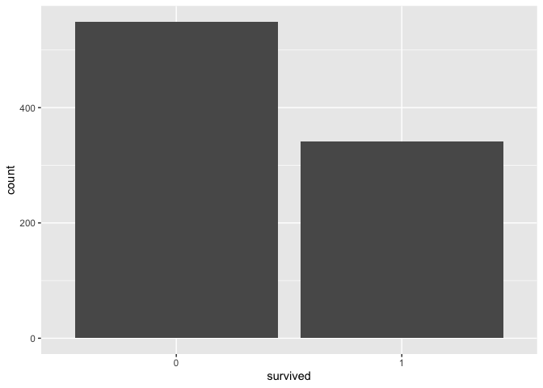<!-- -->

```r
ggplot(data=f_titanic)+geom_bar(aes(embarked)) #~2x C than Q and ~4x S than C 
```

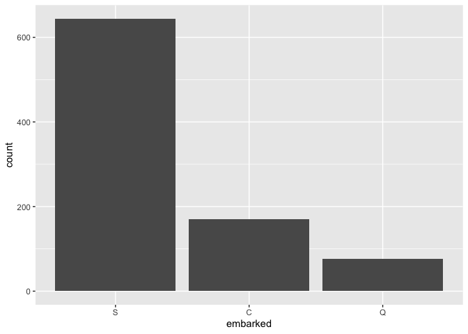<!-- -->

This figure shows that most passengers did not survive and that nearly three quarters of the passengers embarked from Southampton.
\

Age and fare were the only continuous predictors. Their histograms and density plots were visualized.

```r
p1<-ggplot(data=f_titanic)+geom_histogram(aes(age),binwidth=2) 
p2<-ggplot(data=f_titanic)+geom_density(aes(age))
p3<-ggplot(data=f_titanic)+geom_histogram(aes(fare)) 
p4<-ggplot(data=f_titanic)+geom_density(aes(fare))
plot_grid(p1,p2,p3,p4,ncol=2)
```

<!-- -->

Age distribution of passengers appears to be right-skewed normal with a valley around 10 years-old and greater than expected travelers less than 1 year old. Fares appear to resemble a log-normal or gamma distribution, with nearly all tickets costing less than 275 (units unknown/unspecified). However, the histogram and density plot indicate at least one ticket with a high fare.
\
\

#### Bivariate and higher
Relationships between two variables, whether categorical-categorical, categorical-continuous, or continuous-continuous, were explored visually. In one example, age of passengers tended to be higher for individuals in pclass 1 compared to the two other classes.

```r
ggplot(data=f_titanic) +
  geom_boxplot(aes(pclass,age))
```

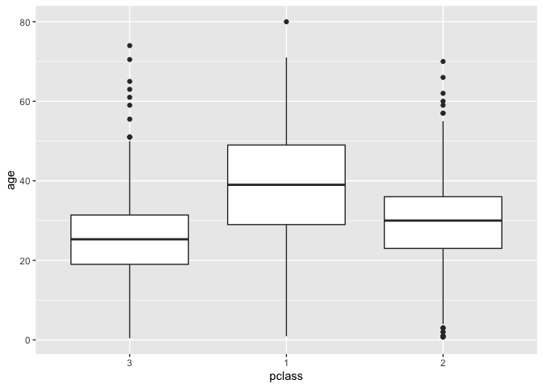<!-- -->

Taken one step further, fares tended to be higher for lower pclasses at each age.

```r
ggplot(data=f_titanic)+geom_point(aes(age,fare,color=pclass)) 
```

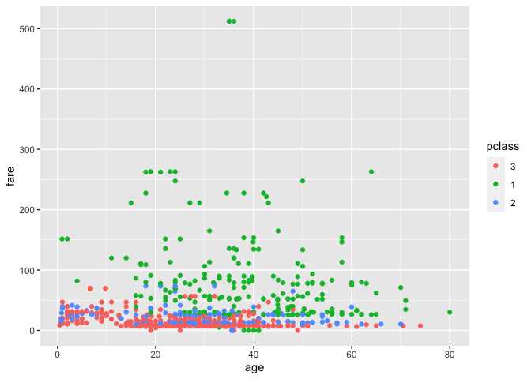<!-- -->
\
\

### Predictors and survival exploration
This project is related to a prediction problem; thus, understanding relationships between predictor variables and the dependent variable were of great interest. Survival and its relationship with age and fare were explored separately.

```r
s1<-ggplot(data=f_titanic,aes(age,..density..)) + 
  geom_freqpoly(aes(color=survived)) +
  theme(legend.position="bottom") #similar pattern in age distrubtion by survival
s2<-ggplot(f_titanic,aes(survived,age)) +
  stat_summary(geom="bar",fill="steelblue") +
  stat_summary(geom="errorbar")
s3<-ggplot(data=f_titanic,aes(fare,..density..)) + 
  geom_freqpoly(aes(color=survived)) +
  theme(legend.position="bottom") #similar to age
s4<-ggplot(f_titanic,aes(survived,fare)) +
  stat_summary(geom="bar",fill="steelblue") +
  stat_summary(geom="errorbar")
plot_grid(s1,s2,s3,s4,ncol=2)
```

<!-- -->

The distribution of ages had similar patterns between survival categories. Younger passengers (i.e., babies, toddlers, and children) tended to have more survivors than non-survivors. However, this pattern reversed for young-middle adults, which resulted in a greater average age of non-survivors than survivors. The relationship between age and survival is unsurprising given the chances of prioritizing saving children over adults. 
\

The distribution of fares tended to shift to the right for survivors than non-survivors, resulting in a greater average fare for survivors. If the passengers with high fares (i.e., > 500), who all survived, are removed, the comparison between mean fares changes minimally.

```r
f_titanic %>%
  filter(fare<=500) %>%
  ggplot(aes(survived,fare)) +
  stat_summary(geom="bar",fill="steelblue") +
  stat_summary(geom="errorbar")
```

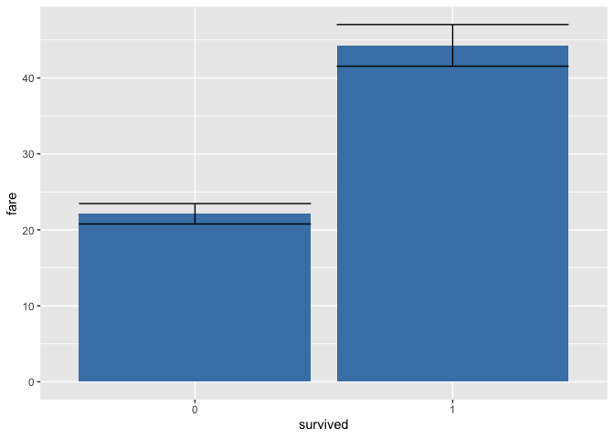<!-- -->
\
For the entire exploratory data analysis code, please see the Appendix.
\
\

## **Modeling**
### Load packages and data and re-level factors
The packages needed in building and testing a prediction model were loaded into R. Note that many of these packages are part of tidymodels or are tidymodels-adjacent. The preprocessed training data were read into R, and two factors, pclass and ticket_cat, were releveled using fct_relevel() from forcats. 

```r
#load packages
library(readr)
library(here)
library(rsample)
library(dplyr)
library(recipes)
library(parsnip)
library(kernlab)
library(workflows)
library(yardstick)
library(tune)
library(janitor)
library(forcats)
library(visdat)
library(stringr)
library(skimr)
library(vip)

#import cleaned and tidied data as a .csv to a tibble
f_titanic<-read_csv(here("data","tidy_data","tidy_train.csv"),
         col_types="fiffnnfffff")

#re-level factors
f_titanic$pclass<-fct_relevel(f_titanic$pclass,c("1","2","3"))
f_titanic$ticket_cat<-fct_relevel(f_titanic$ticket_cat,c("under_10k","10k_up","100k","200k","300k","mil","A","C","P","SC", "SOT","STO","other"))
```
\
\

### Model building
#### Create cross-validation samples
The training data were divided into four subsamples for v-fold cross-validation using vfold_cv() from the rsample package.

```r
set.seed(27)
vfold_titanic<-vfold_cv(data=f_titanic,v=4)
```
\
\

#### Create recipe
The recipe was created by pulling columns from the f_titanic tibble and specifying the role of each column as "id variable," "predictor," or "outcome." The function recipe from the recipes package was used here.

```r
titanic_recipe<-recipe(f_titanic) %>%
  update_role(passenger_id,new_role="id variable") %>% 
  update_role(pclass:fam_size,new_role="predictor") %>% 
  update_role(survived,new_role="outcome")
```
\
\

#### Specify models
The model type was specified using the parsnip package. For this write-up, a logistic regression model and a support-vector machine were assessed. These models were driven by logistic_reg() and svm_poly(), respectively. A logistic regression model was selected as a candidate due to its design for binary classification. A support-vector machne was chosen as it has the ability to differentiate data points in n-dimensional space using non-linear kernel functions.

```r
#logistic regression
titanic_mod_log<-logistic_reg() %>%
  set_mode("classification") %>%
  set_engine("glm") 

#support-vector machine
titanic_mod_svm<-svm_poly() %>%
  set_mode("classification") %>%
  set_engine("kernlab")
```
\
\

#### Make a workflow
A workflow consisting of the recipe and model was created for each model type using workflow() from the workflows package.

```r
#logistic regression
titanic_mod_log_wflow<-workflow() %>%
  add_recipe(titanic_recipe) %>%
  add_model(titanic_mod_log)

#svm 
titanic_mod_svm_wflow<-workflow() %>%
  add_recipe(titanic_recipe) %>%
  add_model(titanic_mod_svm)
```
\
\

#### Fit models
The models were fit to the training data using fit() from the parnsip package.

```r
titanic_mod_log_wflow_fit<-parsnip::fit(titanic_mod_log_wflow,data=f_titanic)

titanic_mod_svm_wflow_fit<-parsnip::fit(titanic_mod_svm_wflow,data=f_titanic) 
```

```
##  Setting default kernel parameters
```
\
\

#### Assess model accuracies
The fit of the models to the training data were assessed for accuracy. Survival of each passenger was predicted using these models and compared with the actual training data using the function accuracy() from the yardstick package.

```r
#get predictions
pred_titanic_log<-predict(titanic_mod_log_wflow_fit,new_data=f_titanic)
pred_titanic_svm<-predict(titanic_mod_svm_wflow_fit,new_data=f_titanic) 

#assess accuracy
accuracy(f_titanic,
         truth=survived,estimate=pred_titanic_log$.pred_class) 
```

```
## # A tibble: 1 x 3
##   .metric  .estimator .estimate
##   <chr>    <chr>          <dbl>
## 1 accuracy binary         0.828
```

```r
accuracy(f_titanic,
         truth=survived,estimate=pred_titanic_svm$.pred_class)
```

```
## # A tibble: 1 x 3
##   .metric  .estimator .estimate
##   <chr>    <chr>          <dbl>
## 1 accuracy binary         0.810
```
These results indicate that predictive accuracy was 82.8% for the logistic regression model and 81% for the support-vector machine. 
\
\

#### Fit models to cross-validation folds
The two models were fit to cross-validation folds using fit_resamples() from the tune package. This will help determine the degree of overfitting and provide the opportunity to tune hyperparameters.

```r
set.seed(523)
resample_log_fit<-fit_resamples(titanic_mod_log_wflow,vfold_titanic)
collect_metrics(resample_log_fit) 
```

```
## # A tibble: 2 x 6
##   .metric  .estimator  mean     n std_err .config             
##   <chr>    <chr>      <dbl> <int>   <dbl> <fct>               
## 1 accuracy binary     0.811     4  0.0167 Preprocessor1_Model1
## 2 roc_auc  binary     0.849     4  0.0140 Preprocessor1_Model1
```

```r
set.seed(523)
resample_svm_fit<-fit_resamples(titanic_mod_svm_wflow,vfold_titanic)
collect_metrics(resample_svm_fit) 
```

```
## # A tibble: 2 x 6
##   .metric  .estimator  mean     n std_err .config             
##   <chr>    <chr>      <dbl> <int>   <dbl> <fct>               
## 1 accuracy binary     0.794     4  0.0138 Preprocessor1_Model1
## 2 roc_auc  binary     0.825     4  0.0195 Preprocessor1_Model1
```
The accuracy of both models dropped using cross-validation. The logistic regression model was more accurate using the cross-validation data (i.e., 81.1% vs. 79.4%). 
\
\

#### Tune models
The hyperparameters of the models were tuned using tune_grid() from the tune package.

```r
#logistic regression model
titanic_mod_log_tune<-logistic_reg(penalty=tune(),mixture=tune()) %>%
  set_mode("classification") %>%
  set_engine("glm")

titanic_mod_log_wflow_tune<-workflow() %>%
  add_recipe(titanic_recipe) %>%
  add_model(titanic_mod_log_tune)

resample_log_fit2<-tune_grid(titanic_mod_log_wflow_tune,resamples=vfold_titanic,grid=30) #not tuning
collect_metrics(resample_log_fit2) #81.1%
```

```
## # A tibble: 2 x 6
##   .metric  .estimator  mean     n std_err .config             
##   <chr>    <chr>      <dbl> <int>   <dbl> <fct>               
## 1 accuracy binary     0.811     4  0.0167 Preprocessor1_Model1
## 2 roc_auc  binary     0.849     4  0.0140 Preprocessor1_Model1
```

```r
#svm 
titanic_mod_svm_tune<-svm_poly(cost=tune(),degree=tune(),scale_factor=tune()) %>%
  set_mode("classification") %>%
  set_engine("kernlab")

titanic_mod_svm_wflow_tune<-workflow() %>%
  add_recipe(titanic_recipe) %>%
  add_model(titanic_mod_svm_tune)

set.seed(95)
resample_svm_fit2<-tune_grid(titanic_mod_svm_wflow_tune,resamples=vfold_titanic,grid=30) 
collect_metrics(resample_svm_fit2)
```

```
## # A tibble: 60 x 9
##       cost degree scale_factor .metric  .estimator  mean     n std_err .config  
##      <dbl>  <dbl>        <dbl> <chr>    <chr>      <dbl> <int>   <dbl> <fct>    
##  1 23.0      2.49     2.15e- 4 accuracy binary     0.786     4 0.0139  Preproce…
##  2 23.0      2.49     2.15e- 4 roc_auc  binary     0.852     4 0.00951 Preproce…
##  3  2.83     1.17     9.15e- 3 accuracy binary     0.785     4 0.0137  Preproce…
##  4  2.83     1.17     9.15e- 3 roc_auc  binary     0.851     4 0.00918 Preproce…
##  5  0.797    2.46     2.31e-10 accuracy binary     0.616     4 0.0191  Preproce…
##  6  0.797    2.46     2.31e-10 roc_auc  binary     0.807     4 0.00204 Preproce…
##  7  0.0542   1.04     1.92e- 8 accuracy binary     0.616     4 0.0191  Preproce…
##  8  0.0542   1.04     1.92e- 8 roc_auc  binary     0.834     4 0.00155 Preproce…
##  9  1.12     1.10     1.68e- 5 accuracy binary     0.616     4 0.0191  Preproce…
## 10  1.12     1.10     1.68e- 5 roc_auc  binary     0.833     4 0.00318 Preproce…
## # … with 50 more rows
```

```r
show_best(resample_svm_fit2,metric="accuracy") 
```

```
## # A tibble: 5 x 9
##       cost degree scale_factor .metric .estimator  mean     n std_err .config   
##      <dbl>  <dbl>        <dbl> <chr>   <chr>      <dbl> <int>   <dbl> <fct>     
## 1 23.0       2.49    0.000215  accura… binary     0.786     4 0.0139  Preproces…
## 2  2.83      1.17    0.00915   accura… binary     0.785     4 0.0137  Preproces…
## 3  0.304     1.61    0.0161    accura… binary     0.785     4 0.00895 Preproces…
## 4 11.0       2.24    0.0000571 accura… binary     0.626     4 0.0222  Preproces…
## 5  0.00495   2.06    0.0894    accura… binary     0.624     4 0.0213  Preproces…
```
The results show that R was unable to tune the logistic regression model (driven by "glm"). Conversely, the cost, polynomial degree, and scale factor of the support-vector machine was tuned by R. The best support-vector machine had slighly lower accuracy after tuning (i.e., 78.6% vs. 79.4%). 
\
\

#### Select best model and finalize workflow
The logistic regression model had better accuracy following tuning. Thus it was selected for testing and its workflow and model were finalized.

```r
tuned_log_values<-select_best(resample_log_fit2,"accuracy")
tuned_log_wflow<-titanic_mod_log_wflow_tune %>%
  finalize_workflow(tuned_log_values)
tuned_log_wflow<-titanic_mod_log_wflow_tune %>%
  finalize_workflow(tuned_log_values)
fitted_tuned_log_mod<-fit(tuned_log_wflow,f_titanic) %>% pull_workflow_fit()
```
\
\

#### Assess model characteristics
To further understand the best model, variable coefficients and importance were explored. The latter was accomplished using vi() and vip() from the vip package. 

```r
log_mod_coef<-enframe(fitted_tuned_log_mod$fit$coefficients)
log_mod_coef %>% 
  rename(coef="value") %>%
  arrange(desc(coef)) %>%
  print(n=30)
```

```
## # A tibble: 30 x 2
##    name                   coef
##    <chr>                 <dbl>
##  1 sexfemale          15.1    
##  2 cabin_typeE         1.66   
##  3 ticket_catSTO       1.25   
##  4 cabin_typeF         1.09   
##  5 cabin_typeD         0.936  
##  6 cabin_typeA         0.866  
##  7 (Intercept)         0.777  
##  8 cabin_typeB         0.690  
##  9 embarkedQ           0.688  
## 10 ticket_catmil       0.527  
## 11 ticket_cat10k_up    0.471  
## 12 ticket_catC         0.354  
## 13 embarkedC           0.311  
## 14 fam_sizesolo        0.186  
## 15 cabin_typeC         0.149  
## 16 ticket_cat200k      0.137  
## 17 ticket_catSC        0.0302 
## 18 fare                0.00361
## 19 age                -0.0512 
## 20 ticket_catP        -0.358  
## 21 ticket_catSOT      -0.363  
## 22 ticket_cat100k     -0.379  
## 23 ticket_catother    -0.379  
## 24 ticket_cat300k     -0.511  
## 25 pclass2            -0.978  
## 26 ticket_catA        -1.05   
## 27 pclass3            -1.66   
## 28 fam_sizelarge      -2.29   
## 29 marital_statusFm  -11.8    
## 30 marital_statusFum -12.8
```

```r
vi(fitted_tuned_log_mod)
```

```
## # A tibble: 29 x 3
##    Variable       Importance Sign 
##    <chr>               <dbl> <chr>
##  1 age                  5.39 NEG  
##  2 fam_sizelarge        4.80 NEG  
##  3 cabin_typeE          2.79 POS  
##  4 pclass3              2.47 NEG  
##  5 ticket_catSTO        1.92 POS  
##  6 embarkedQ            1.84 POS  
##  7 pclass2              1.55 NEG  
##  8 cabin_typeD          1.50 POS  
##  9 cabin_typeF          1.36 POS  
## 10 ticket_cat300k       1.32 NEG  
## # … with 19 more rows
```

```r
vip(fitted_tuned_log_mod)
```

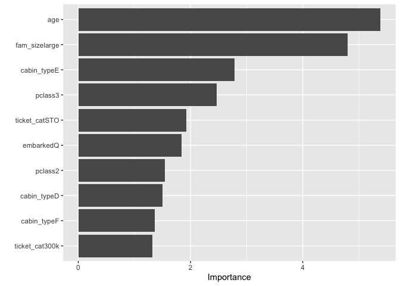<!-- -->

Interpretation of variable coefficients depends on the predictor variable type. If it is continuous, then as that predictor increases, the dependent variable (i.e., survival) will likely increase/decrease depending on the sign and magnitude of the coefficient. For categorical predictors, the sign and importance indicate the likely direction of change in the dependent variable as the predictor changes from the reference level to the stated level. For example, sexfemale has a coefficient of +15.1; thus, a female passenger is more likely to survive than a male (reference level) passenger. The graph of variable importance shows that age was the most important predictor, followed by large family size, and cabin type E.
\
\

### Test model
#### Preliminary steps
The logistic regression model was assessed on test data, which were exogenous to model fitting and cross-validaiton, to measure its out-of-sample accuracy. These data were preprocessed using the same methods for the training data. The tasks include cleaning column names, imputing data, and feature engineering. Code for these steps can be found in the Appendix.
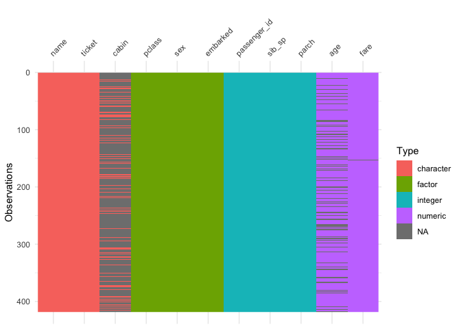<!-- --><!-- -->
\
\

#### Predict survival on test data
Once the test data were converted into a clean and tidy form, the logistic regression model was run on these data to predict survival and assess accuracy. The predict() function was used to generate predicted survival values. These data were combined with the passenger ids, saved as a csv file, and submitted to Kaggle to assess accuracy.

```r
pred_titanic<-predict(fitted_tuned_log_mod,new_data=ft_titanic)
kpost_titanic_submit<-bind_cols(ft_titanic$passenger_id,pred_titanic[,1])
kpost_titanic_submit<-rename(kpost_titanic_submit,PassengerID="...1",Survived=".pred_class")
write_csv(kpost_titanic_submit,here("data","predictions","kpost_titanic_submission.csv"))
```
This model was 76.794% accurate in predicting survival of passengers from the test data. 
\
\
\

## Appendix
### Feature engineering code
#### Cabin

```r
c_titanic$cabin[str_which(c_titanic$cabin,"^T|^G")]<-"unknown_other" 
#replaces T & G cabins with u_o (few numbers)

#bin cabin names by first letter into types
c_titanic<-c_titanic %>%
  mutate(cabin_type=case_when(
    str_detect(cabin,"^A")~"A",
    str_detect(cabin,"^B")~"B",
    str_detect(cabin,"^C")~"C",
    str_detect(cabin,"^D")~"D",
    str_detect(cabin,"^E")~"E",
    str_detect(cabin,"^F")~"F",
    str_detect(cabin,"unknown_other")~"UO"
  )) 
head(c_titanic[,12:13],10) #check, and it works
```

```
## # A tibble: 10 x 2
##    cabin         cabin_type
##    <chr>         <chr>     
##  1 unknown_other UO        
##  2 C85           C         
##  3 unknown_other UO        
##  4 C123          C         
##  5 unknown_other UO        
##  6 unknown_other UO        
##  7 E46           E         
##  8 unknown_other UO        
##  9 unknown_other UO        
## 10 unknown_other UO
```

```r
tabyl(c_titanic$cabin_type) #cabin_type level with lowest obs is F with 13
```

```
##  c_titanic$cabin_type   n    percent
##                     A  15 0.01683502
##                     B  47 0.05274972
##                     C  59 0.06621773
##                     D  33 0.03703704
##                     E  32 0.03591470
##                     F  13 0.01459035
##                    UO 692 0.77665544
```

```r
sum(is.na(c_titanic$cabin_type)) #0; no NAs
```

```
## [1] 0
```

```r
c_titanic$cabin_type<-as.factor(c_titanic$cabin_type) #makes it a factor
levels(c_titanic$cabin_type) #7 levels
```

```
## [1] "A"  "B"  "C"  "D"  "E"  "F"  "UO"
```
\
\

#### Ticket

```r
c_titanic$ticket<-
  str_replace_all(c_titanic$ticket,"[[:punct:]]","") #removes punctuation

#preview some of the ticket prefixes
filter(c_titanic,str_detect(ticket,"^STO"))
```

```
## # A tibble: 18 x 16
##    survived passenger_id pclass sex     age sib_sp parch  fare embarked name 
##    <fct>           <int> <fct>  <fct> <dbl>  <int> <int> <dbl> <fct>    <chr>
##  1 1                   3 3      fema…    26      0     0  7.92 S        Heik…
##  2 0                 116 3      male     21      0     0  7.92 S        Peko…
##  3 1                 143 3      fema…    24      1     0 15.8  S        Hakk…
##  4 0                 174 3      male     21      0     0  7.92 S        Sivo…
##  5 1                 217 3      fema…    27      0     0  7.92 S        Honk…
##  6 0                 244 3      male     22      0     0  7.12 S        Maen…
##  7 0                 383 3      male     32      0     0  7.92 S        Tikk…
##  8 1                 401 3      male     39      0     0  7.92 S        Nisk…
##  9 0                 404 3      male     28      1     0 15.8  S        Hakk…
## 10 1                 415 3      male     44      0     0  7.92 S        Sund…
## 11 0                 434 3      male     17      0     0  7.12 S        Kall…
## 12 1                 580 3      male     32      0     0  7.92 S        Juss…
## 13 0                 591 3      male     35      0     0  7.12 S        Rint…
## 14 0                 637 3      male     32      0     0  7.92 S        Lein…
## 15 1                 665 3      male     20      1     0  7.92 S        Lind…
## 16 0                 730 3      fema…    25      1     0  7.92 S        Ilma…
## 17 1                 745 3      male     31      0     0  7.92 S        Stra…
## 18 0                 817 3      fema…    23      0     0  7.92 S        Hein…
## # … with 6 more variables: ticket <chr>, cabin <chr>, cabin_type <fct>,
## #   ticket_cat <fct>, marital_status <fct>, fam_size <fct>
```

```r
filter(c_titanic,str_detect(ticket,"^SOT"))
```

```
## # A tibble: 17 x 16
##    survived passenger_id pclass sex     age sib_sp parch  fare embarked name 
##    <fct>           <int> <fct>  <fct> <dbl>  <int> <int> <dbl> <fct>    <chr>
##  1 0                  88 3      male   31.4      0     0  8.05 S        Sloc…
##  2 0                 132 3      male   20        0     0  7.05 S        Coel…
##  3 0                 158 3      male   30        0     0  8.05 S        Corn…
##  4 0                 211 3      male   24        0     0  7.05 S        Ali,…
##  5 1                 221 3      male   16        0     0  8.05 S        Sund…
##  6 0                 364 3      male   35        0     0  7.05 S        Asim…
##  7 1                 430 3      male   32        0     0  8.05 S        Pick…
##  8 0                 466 3      male   38        0     0  7.05 S        Gonc…
##  9 0                 492 3      male   21        0     0  7.25 S        Wind…
## 10 0                 512 3      male   31.4      0     0  8.05 S        Webb…
## 11 0                 564 3      male   31.4      0     0  8.05 S        Simm…
## 12 0                 565 3      fema…  24        0     0  8.05 S        Mean…
## 13 0                 612 3      male   32.1      0     0  7.05 S        Jard…
## 14 0                 762 3      male   41        0     0  7.12 S        Nirv…
## 15 0                 785 3      male   25        0     0  7.05 S        Ali,…
## 16 0                 841 3      male   20        0     0  7.92 S        Alho…
## 17 0                 885 3      male   25        0     0  7.05 S        Sute…
## # … with 6 more variables: ticket <chr>, cabin <chr>, cabin_type <fct>,
## #   ticket_cat <fct>, marital_status <fct>, fam_size <fct>
```

```r
filter(c_titanic,str_detect(ticket,"^S")) %>% print(n=10)
```

```
## # A tibble: 65 x 16
##    survived passenger_id pclass sex     age sib_sp parch  fare embarked name 
##    <fct>           <int> <fct>  <fct> <dbl>  <int> <int> <dbl> <fct>    <chr>
##  1 1                   3 3      fema…  26        0     0  7.92 S        Heik…
##  2 1                  44 2      fema…   3        1     2 41.6  C        Laro…
##  3 0                  46 3      male   31.4      0     0  8.05 S        Roge…
##  4 0                  68 3      male   19        0     0  8.16 S        Crea…
##  5 0                  73 2      male   21        0     0 73.5  S        Hood…
##  6 1                  85 2      fema…  17        0     0 10.5  S        Ilet…
##  7 0                  88 3      male   31.4      0     0  8.05 S        Sloc…
##  8 0                 116 3      male   21        0     0  7.92 S        Peko…
##  9 0                 121 2      male   21        2     0 73.5  S        Hick…
## 10 0                 132 3      male   20        0     0  7.05 S        Coel…
## # … with 55 more rows, and 6 more variables: ticket <chr>, cabin <chr>,
## #   cabin_type <fct>, ticket_cat <fct>, marital_status <fct>, fam_size <fct>
```

```r
filter(c_titanic,str_detect(ticket,"^SO(C|P)")) %>% print(n=10)
```

```
## # A tibble: 10 x 16
##    survived passenger_id pclass sex     age sib_sp parch  fare embarked name 
##    <fct>           <int> <fct>  <fct> <dbl>  <int> <int> <dbl> <fct>    <chr>
##  1 0                  73 2      male     21      0     0 73.5  S        Hood…
##  2 1                  85 2      fema…    17      0     0 10.5  S        Ilet…
##  3 0                 121 2      male     21      2     0 73.5  S        Hick…
##  4 0                 151 2      male     51      0     0 12.5  S        Bate…
##  5 0                 386 2      male     18      0     0 73.5  S        Davi…
##  6 0                 649 3      male     31      0     0  7.55 S        Will…
##  7 0                 656 2      male     24      2     0 73.5  S        Hick…
##  8 0                 666 2      male     32      2     0 73.5  S        Hick…
##  9 0                 773 2      fema…    57      0     0 10.5  S        Mack…
## 10 0                 842 2      male     16      0     0 10.5  S        Mudd…
## # … with 6 more variables: ticket <chr>, cabin <chr>, cabin_type <fct>,
## #   ticket_cat <fct>, marital_status <fct>, fam_size <fct>
```


```r
#look more closely at ticket number (based on number ranges) and survival
c_titanic %>% filter(as.numeric(ticket)<10000) %>% tabyl(survived) #less than 10k; 36% survival
```

```
##  survived  n   percent
##         0 63 0.6363636
##         1 36 0.3636364
```

```r
c_titanic %>% filter(between(as.numeric(ticket),10000,100000)) %>% tabyl(survived) #b/t 10k & 100k; 62% survival
```

```
##  survived  n   percent
##         0 50 0.3816794
##         1 81 0.6183206
```

```r
c_titanic %>% filter(between(as.numeric(ticket),100000,200000)) %>% tabyl(survived) #b/t 100 & 200k; 51% survival
```

```
##  survived  n   percent
##         0 35 0.4861111
##         1 37 0.5138889
```

```r
c_titanic %>% filter(between(as.numeric(ticket),200000,300000)) %>% tabyl(survived) #b/t 200 & 300k; 48% survival
```

```
##  survived  n   percent
##         0 45 0.5172414
##         1 42 0.4827586
```

```r
c_titanic %>% filter(between(as.numeric(ticket),100000,1000000)) %>% tabyl(survived) #b/t 100k & 1 mil.; 32% survival
```

```
##  survived   n   percent
##         0 282 0.6795181
##         1 133 0.3204819
```

```r
#note: bin all 5-digit ticket numbers then you lose effect of 300k range
c_titanic %>% filter(between(as.numeric(ticket),300000,1000000)) %>% tabyl(survived) #b/t 300k & 1 mil.; 21% survivalk
```

```
##  survived   n   percent
##         0 202 0.7890625
##         1  54 0.2109375
```

```r
c_titanic %>% filter(as.numeric(ticket)>1000000) %>% tabyl(survived) #greater than 1 mil.; 25% survival
```

```
##  survived  n percent
##         0 12    0.75
##         1  4    0.25
```

```r
#appears to be association between ticket number and survival
```


```r
#bins ticket prefixes into categories
c_titanic<-c_titanic %>% 
  mutate(ticket_cat=case_when(
    as.numeric(ticket)<10000~"under_10k",
    between(as.numeric(ticket),10000,100000)~"10k_up",
    between(as.numeric(ticket),100000,200000)~"100k",
    between(as.numeric(ticket),200000,300000)~"200k",
    between(as.numeric(ticket),300000,1000000)~"300k",
    as.numeric(ticket)>1000000~"mil",
    str_detect(ticket,"^A")~"A",
    str_detect(ticket,"^C")~"C",
    str_detect(ticket,"^P")~"P",
    str_detect(ticket,"^SC")~"SC",
    str_detect(ticket,"^SOT")~"SOT",
    str_detect(ticket,"^S(TO)")~"STO",
    str_detect(ticket,"^SO(C|P)")~"other",
    str_detect(ticket,"^W|^F|^L|^SP|^SW")~"other"
  )) 
unique(c_titanic$ticket_cat)
```

```
##  [1] "A"         "P"         "STO"       "100k"      "300k"      "10k_up"   
##  [7] "200k"      "under_10k" "C"         "SC"        "mil"       "other"    
## [13] "SOT"
```

```r
sum(is.na(c_titanic$ticket_cat)) #0; no NAs
```

```
## [1] 0
```

```r
c_titanic$ticket_cat<-as.factor(c_titanic$ticket_cat) #makes it a factor
levels(c_titanic$ticket_cat)
```

```
##  [1] "100k"      "10k_up"    "200k"      "300k"      "A"         "C"        
##  [7] "mil"       "other"     "P"         "SC"        "SOT"       "STO"      
## [13] "under_10k"
```

```r
c_titanic$ticket_cat<-fct_relevel(c_titanic$ticket_cat,
                                  "under_10k",
                                  "10k_up",
                                  "100k",
                                  "200k",
                                  "300k",
                                  "mil",
                                  "A",
                                  "C",
                                  "P",
                                  "SC",
                                  "SOT",
                                  "STO",
                                  "other")
levels(c_titanic$ticket_cat)                           
```

```
##  [1] "under_10k" "10k_up"    "100k"      "200k"      "300k"      "mil"      
##  [7] "A"         "C"         "P"         "SC"        "SOT"       "STO"      
## [13] "other"
```

```r
tabyl(c_titanic,survived,ticket_cat) #clearly some ticket numbers/prefixes are associated with survival
```

```
##  survived under_10k 10k_up 100k 200k 300k mil  A  C  P SC SOT STO other
##         0        63     50   35   45  202  12 27 31 23  9  15  10    27
##         1        36     81   37   42   54   4  2 16 42  8   2   8    10
```
\
\

#### Marital Status

```r
#marital status: extract fromm name variable 
#test of coding 
length(str_subset(c_titanic$name,"Mrs")) #129
```

```
## [1] 129
```

```r
head(str_subset(c_titanic$name,"Mrs"),n=15) #sample of above
```

```
##  [1] "Cumings, Mrs. John Bradley (Florence Briggs Thayer)"      
##  [2] "Futrelle, Mrs. Jacques Heath (Lily May Peel)"             
##  [3] "Johnson, Mrs. Oscar W (Elisabeth Vilhelmina Berg)"        
##  [4] "Nasser, Mrs. Nicholas (Adele Achem)"                      
##  [5] "Hewlett, Mrs. (Mary D Kingcome)"                          
##  [6] "Vander Planke, Mrs. Julius (Emelia Maria Vandemoortele)"  
##  [7] "Masselmani, Mrs. Fatima"                                  
##  [8] "Asplund, Mrs. Carl Oscar (Selma Augusta Emilia Johansson)"
##  [9] "Spencer, Mrs. William Augustus (Marie Eugenie)"           
## [10] "Ahlin, Mrs. Johan (Johanna Persdotter Larsson)"           
## [11] "Turpin, Mrs. William John Robert (Dorothy Ann Wonnacott)" 
## [12] "Arnold-Franchi, Mrs. Josef (Josefine Franchi)"            
## [13] "Harper, Mrs. Henry Sleeper (Myna Haxtun)"                 
## [14] "Faunthorpe, Mrs. Lizzie (Elizabeth Anne Wilkinson)"       
## [15] "Nye, Mrs. (Elizabeth Ramell)"
```

```r
length(str_subset(c_titanic$name,"Mrs\\.")) #125 married women
```

```
## [1] 125
```

```r
head(str_subset(c_titanic$name,"Mrs\\."),n=15) #sample of above
```

```
##  [1] "Cumings, Mrs. John Bradley (Florence Briggs Thayer)"      
##  [2] "Futrelle, Mrs. Jacques Heath (Lily May Peel)"             
##  [3] "Johnson, Mrs. Oscar W (Elisabeth Vilhelmina Berg)"        
##  [4] "Nasser, Mrs. Nicholas (Adele Achem)"                      
##  [5] "Hewlett, Mrs. (Mary D Kingcome)"                          
##  [6] "Vander Planke, Mrs. Julius (Emelia Maria Vandemoortele)"  
##  [7] "Masselmani, Mrs. Fatima"                                  
##  [8] "Asplund, Mrs. Carl Oscar (Selma Augusta Emilia Johansson)"
##  [9] "Spencer, Mrs. William Augustus (Marie Eugenie)"           
## [10] "Ahlin, Mrs. Johan (Johanna Persdotter Larsson)"           
## [11] "Turpin, Mrs. William John Robert (Dorothy Ann Wonnacott)" 
## [12] "Arnold-Franchi, Mrs. Josef (Josefine Franchi)"            
## [13] "Harper, Mrs. Henry Sleeper (Myna Haxtun)"                 
## [14] "Faunthorpe, Mrs. Lizzie (Elizabeth Anne Wilkinson)"       
## [15] "Nye, Mrs. (Elizabeth Ramell)"
```

```r
str_subset(c_titanic$name,"Mme\\.") #married woman; 1
```

```
## [1] "Aubart, Mme. Leontine Pauline"
```

```r
str_subset(c_titanic$name,"Lady\\.(.*)Mrs") #married woman; 1
```

```
## [1] "Duff Gordon, Lady. (Lucille Christiana Sutherland) (\"Mrs Morgan\")"
```

```r
str_subset(c_titanic$name,"Dr\\.") #1 female doctor; unknown marital status
```

```
## [1] "Minahan, Dr. William Edward"   "Moraweck, Dr. Ernest"         
## [3] "Pain, Dr. Alfred"              "Stahelin-Maeglin, Dr. Max"    
## [5] "Frauenthal, Dr. Henry William" "Brewe, Dr. Arthur Jackson"    
## [7] "Leader, Dr. Alice (Farnham)"
```

```r
str_subset(c_titanic$name,"Countess\\.") #1 countess; unknown marital status
```

```
## [1] "Rothes, the Countess. of (Lucy Noel Martha Dyer-Edwards)"
```

```r
str_subset(c_titanic$name,"Ms\\.") #unknown marital status; 1
```

```
## [1] "Reynaldo, Ms. Encarnacion"
```

```r
head(str_subset(c_titanic$name, "Miss\\."),n=15) #unmarried women; 182
```

```
##  [1] "Heikkinen, Miss. Laina"                  
##  [2] "Sandstrom, Miss. Marguerite Rut"         
##  [3] "Bonnell, Miss. Elizabeth"                
##  [4] "Vestrom, Miss. Hulda Amanda Adolfina"    
##  [5] "McGowan, Miss. Anna \"Annie\""           
##  [6] "Palsson, Miss. Torborg Danira"           
##  [7] "O'Dwyer, Miss. Ellen \"Nellie\""         
##  [8] "Glynn, Miss. Mary Agatha"                
##  [9] "Vander Planke, Miss. Augusta Maria"      
## [10] "Nicola-Yarred, Miss. Jamila"             
## [11] "Laroche, Miss. Simonne Marie Anne Andree"
## [12] "Devaney, Miss. Margaret Delia"           
## [13] "O'Driscoll, Miss. Bridget"               
## [14] "Rugg, Miss. Emily"                       
## [15] "West, Miss. Constance Mirium"
```

```r
str_subset(c_titanic$name,"Mlle\\.") #unmarried women; 2
```

```
## [1] "Sagesser, Mlle. Emma"                              
## [2] "Mayne, Mlle. Berthe Antonine (\"Mrs de Villiers\")"
```

```r
125+1+1+1+1+1+182+2 #314
```

```
## [1] 314
```

```r
filter(c_titanic,sex=="female") #314
```

```
## # A tibble: 314 x 16
##    survived passenger_id pclass sex     age sib_sp parch  fare embarked name 
##    <fct>           <int> <fct>  <fct> <dbl>  <int> <int> <dbl> <fct>    <chr>
##  1 1                   2 1      fema…    38      1     0 71.3  C        Cumi…
##  2 1                   3 3      fema…    26      0     0  7.92 S        Heik…
##  3 1                   4 1      fema…    35      1     0 53.1  S        Futr…
##  4 1                   9 3      fema…    27      0     2 11.1  S        John…
##  5 1                  10 2      fema…    14      1     0 30.1  C        Nass…
##  6 1                  11 3      fema…     4      1     1 16.7  S        Sand…
##  7 1                  12 1      fema…    58      0     0 26.6  S        Bonn…
##  8 0                  15 3      fema…    14      0     0  7.85 S        Vest…
##  9 1                  16 2      fema…    55      0     0 16    S        Hewl…
## 10 0                  19 3      fema…    31      1     0 18    S        Vand…
## # … with 304 more rows, and 6 more variables: ticket <chr>, cabin <chr>,
## #   cabin_type <fct>, ticket_cat <fct>, marital_status <fct>, fam_size <fct>
```

```r
#variable creation (for marital status): unk_na=male & unk f; Fm=married female; Fum: unmarried female
c_titanic<-c_titanic %>%
  mutate(marital_status=case_when(
    sex=="male"~"unk_na",
    str_detect(name,"Mrs\\.|Mme\\.|Lady\\.(.*)Mrs")~"Fm",
    sex=="female" & str_detect(name,"Dr\\.")~"unk_na",
    str_detect(name,"Countess\\.|Ms.|Dona\\.")~"unk_na",
    str_detect(name,"Miss\\.|Mlle\\.")~"Fum"
  ))

unique(c_titanic$marital_status) #3 categories
```

```
## [1] "unk_na" "Fm"     "Fum"
```

```r
sum(is.na(c_titanic$marital_status)) #0; no NAs
```

```
## [1] 0
```

```r
c_titanic$marital_status<-as.factor(c_titanic$marital_status) #makes it a factor
levels(c_titanic$marital_status) #same 3 categories
```

```
## [1] "Fm"     "Fum"    "unk_na"
```
\
\

#### Family Size

```r
#family size: combine parch and sib_sp and bin by size (solo=0, small=1-3, large=4+)
c_titanic<-c_titanic %>% mutate(fam_size=parch+sib_sp)
tabyl(c_titanic,fam_size,survived)
```

```
##  fam_size   0   1
##         0 374 163
##         1  72  89
##         2  43  59
##         3   8  21
##         4  12   3
##         5  19   3
##         6   8   4
##         7   6   0
##        10   7   0
```

```r
c_titanic$fam_size<-as.factor(c_titanic$fam_size)
c_titanic$fam_size<-fct_collapse(c_titanic$fam_size,solo="0",small=c("1","2","3"),
                                 large=c("4","5","6","7","8","9","10","11","12","13","14","15","16","17",
                                         "18","19","20"))
levels(c_titanic$fam_size) #3 levels
```

```
## [1] "solo"  "small" "large"
```
\
\

## Exploratory Data Analysis Code

```r
#Summary stats 
summary(f_titanic)
```

```
##  survived  passenger_id   pclass      sex           age             fare       
##  0:549    Min.   :  1.0   1:216   male  :577   Min.   : 0.42   Min.   :  0.00  
##  1:342    1st Qu.:223.5   2:184   female:314   1st Qu.:21.00   1st Qu.:  7.91  
##           Median :446.0   3:491                Median :28.65   Median : 14.45  
##           Mean   :446.0                        Mean   :29.76   Mean   : 32.20  
##           3rd Qu.:668.5                        3rd Qu.:37.30   3rd Qu.: 31.00  
##           Max.   :891.0                        Max.   :80.00   Max.   :512.33  
##                                                                                
##  embarked cabin_type     ticket_cat  marital_status  fam_size  
##  S:644    UO:692     300k     :256   unk_na:580     small:292  
##  C:170    C : 59     10k_up   :131   Fm    :127     solo :537  
##  Q: 77    E : 32     under_10k: 99   Fum   :184     large: 62  
##           D : 33     200k     : 87                             
##           A : 15     100k     : 72                             
##           B : 47     P        : 65                             
##           F : 13     (Other)  :181
```

```r
skim(f_titanic) 
```


<table style='width: auto;'
        class='table table-condensed'>
<caption>Data summary</caption>
 <thead>
  <tr>
   <th style="text-align:left;">   </th>
   <th style="text-align:left;">   </th>
  </tr>
 </thead>
<tbody>
  <tr>
   <td style="text-align:left;"> Name </td>
   <td style="text-align:left;"> f_titanic </td>
  </tr>
  <tr>
   <td style="text-align:left;"> Number of rows </td>
   <td style="text-align:left;"> 891 </td>
  </tr>
  <tr>
   <td style="text-align:left;"> Number of columns </td>
   <td style="text-align:left;"> 11 </td>
  </tr>
  <tr>
   <td style="text-align:left;"> _______________________ </td>
   <td style="text-align:left;">  </td>
  </tr>
  <tr>
   <td style="text-align:left;"> Column type frequency: </td>
   <td style="text-align:left;">  </td>
  </tr>
  <tr>
   <td style="text-align:left;"> factor </td>
   <td style="text-align:left;"> 8 </td>
  </tr>
  <tr>
   <td style="text-align:left;"> numeric </td>
   <td style="text-align:left;"> 3 </td>
  </tr>
  <tr>
   <td style="text-align:left;"> ________________________ </td>
   <td style="text-align:left;">  </td>
  </tr>
  <tr>
   <td style="text-align:left;"> Group variables </td>
   <td style="text-align:left;">  </td>
  </tr>
</tbody>
</table>


**Variable type: factor**

<table>
 <thead>
  <tr>
   <th style="text-align:left;"> skim_variable </th>
   <th style="text-align:right;"> n_missing </th>
   <th style="text-align:right;"> complete_rate </th>
   <th style="text-align:left;"> ordered </th>
   <th style="text-align:right;"> n_unique </th>
   <th style="text-align:left;"> top_counts </th>
  </tr>
 </thead>
<tbody>
  <tr>
   <td style="text-align:left;"> survived </td>
   <td style="text-align:right;"> 0 </td>
   <td style="text-align:right;"> 1 </td>
   <td style="text-align:left;"> FALSE </td>
   <td style="text-align:right;"> 2 </td>
   <td style="text-align:left;"> 0: 549, 1: 342 </td>
  </tr>
  <tr>
   <td style="text-align:left;"> pclass </td>
   <td style="text-align:right;"> 0 </td>
   <td style="text-align:right;"> 1 </td>
   <td style="text-align:left;"> FALSE </td>
   <td style="text-align:right;"> 3 </td>
   <td style="text-align:left;"> 3: 491, 1: 216, 2: 184 </td>
  </tr>
  <tr>
   <td style="text-align:left;"> sex </td>
   <td style="text-align:right;"> 0 </td>
   <td style="text-align:right;"> 1 </td>
   <td style="text-align:left;"> FALSE </td>
   <td style="text-align:right;"> 2 </td>
   <td style="text-align:left;"> mal: 577, fem: 314 </td>
  </tr>
  <tr>
   <td style="text-align:left;"> embarked </td>
   <td style="text-align:right;"> 0 </td>
   <td style="text-align:right;"> 1 </td>
   <td style="text-align:left;"> FALSE </td>
   <td style="text-align:right;"> 3 </td>
   <td style="text-align:left;"> S: 644, C: 170, Q: 77 </td>
  </tr>
  <tr>
   <td style="text-align:left;"> cabin_type </td>
   <td style="text-align:right;"> 0 </td>
   <td style="text-align:right;"> 1 </td>
   <td style="text-align:left;"> FALSE </td>
   <td style="text-align:right;"> 7 </td>
   <td style="text-align:left;"> UO: 692, C: 59, B: 47, D: 33 </td>
  </tr>
  <tr>
   <td style="text-align:left;"> ticket_cat </td>
   <td style="text-align:right;"> 0 </td>
   <td style="text-align:right;"> 1 </td>
   <td style="text-align:left;"> FALSE </td>
   <td style="text-align:right;"> 13 </td>
   <td style="text-align:left;"> 300: 256, 10k: 131, und: 99, 200: 87 </td>
  </tr>
  <tr>
   <td style="text-align:left;"> marital_status </td>
   <td style="text-align:right;"> 0 </td>
   <td style="text-align:right;"> 1 </td>
   <td style="text-align:left;"> FALSE </td>
   <td style="text-align:right;"> 3 </td>
   <td style="text-align:left;"> unk: 580, Fum: 184, Fm: 127 </td>
  </tr>
  <tr>
   <td style="text-align:left;"> fam_size </td>
   <td style="text-align:right;"> 0 </td>
   <td style="text-align:right;"> 1 </td>
   <td style="text-align:left;"> FALSE </td>
   <td style="text-align:right;"> 3 </td>
   <td style="text-align:left;"> sol: 537, sma: 292, lar: 62 </td>
  </tr>
</tbody>
</table>


**Variable type: numeric**

<table>
 <thead>
  <tr>
   <th style="text-align:left;"> skim_variable </th>
   <th style="text-align:right;"> n_missing </th>
   <th style="text-align:right;"> complete_rate </th>
   <th style="text-align:right;"> mean </th>
   <th style="text-align:right;"> sd </th>
   <th style="text-align:right;"> p0 </th>
   <th style="text-align:right;"> p25 </th>
   <th style="text-align:right;"> p50 </th>
   <th style="text-align:right;"> p75 </th>
   <th style="text-align:right;"> p100 </th>
   <th style="text-align:left;"> hist </th>
  </tr>
 </thead>
<tbody>
  <tr>
   <td style="text-align:left;"> passenger_id </td>
   <td style="text-align:right;"> 0 </td>
   <td style="text-align:right;"> 1 </td>
   <td style="text-align:right;"> 446.00 </td>
   <td style="text-align:right;"> 257.35 </td>
   <td style="text-align:right;"> 1.00 </td>
   <td style="text-align:right;"> 223.50 </td>
   <td style="text-align:right;"> 446.00 </td>
   <td style="text-align:right;"> 668.5 </td>
   <td style="text-align:right;"> 891.00 </td>
   <td style="text-align:left;"> ▇▇▇▇▇ </td>
  </tr>
  <tr>
   <td style="text-align:left;"> age </td>
   <td style="text-align:right;"> 0 </td>
   <td style="text-align:right;"> 1 </td>
   <td style="text-align:right;"> 29.76 </td>
   <td style="text-align:right;"> 13.67 </td>
   <td style="text-align:right;"> 0.42 </td>
   <td style="text-align:right;"> 21.00 </td>
   <td style="text-align:right;"> 28.65 </td>
   <td style="text-align:right;"> 37.3 </td>
   <td style="text-align:right;"> 80.00 </td>
   <td style="text-align:left;"> ▂▇▅▂▁ </td>
  </tr>
  <tr>
   <td style="text-align:left;"> fare </td>
   <td style="text-align:right;"> 0 </td>
   <td style="text-align:right;"> 1 </td>
   <td style="text-align:right;"> 32.20 </td>
   <td style="text-align:right;"> 49.69 </td>
   <td style="text-align:right;"> 0.00 </td>
   <td style="text-align:right;"> 7.91 </td>
   <td style="text-align:right;"> 14.45 </td>
   <td style="text-align:right;"> 31.0 </td>
   <td style="text-align:right;"> 512.33 </td>
   <td style="text-align:left;"> ▇▁▁▁▁ </td>
  </tr>
</tbody>
</table>

```r
#Predictors only
#Univariate
#categorical
ggplot(data=f_titanic)+geom_bar(aes(survived)) #~550 Died & ~350 Survived
```

<!-- -->

```r
ggplot(data=f_titanic)+geom_bar(aes(pclass)) #almost 2.5x class 3 than 1 or 2
```

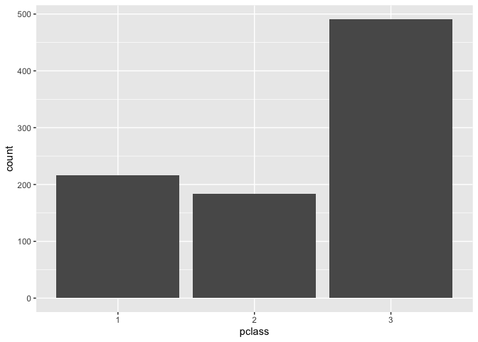<!-- -->

```r
ggplot(data=f_titanic)+geom_bar(aes(embarked)) #~2x C than Q and ~4x S than C 
```

<!-- -->

```r
ggplot(data=f_titanic)+geom_bar(aes(fam_size)) #~600 0, ~300 small, and ~ 50 large
```

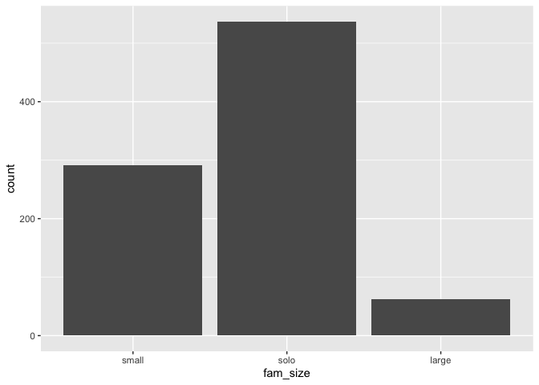<!-- -->

```r
#most passengers traveled alone

#continuous
p1<-ggplot(data=f_titanic)+geom_histogram(aes(age),binwidth=2) #right-skewed normal with a valley ~10 yo and higher than expected <1 yo
p2<-ggplot(data=f_titanic)+geom_density(aes(age))
p3<-ggplot(data=f_titanic)+geom_histogram(aes(fare)) #fares generally under $275 except for at least one >$500; resembles Poisson distribution
p4<-ggplot(data=f_titanic)+geom_density(aes(fare))
plot_grid(p1,p2,p3,p4,ncol=2)
```

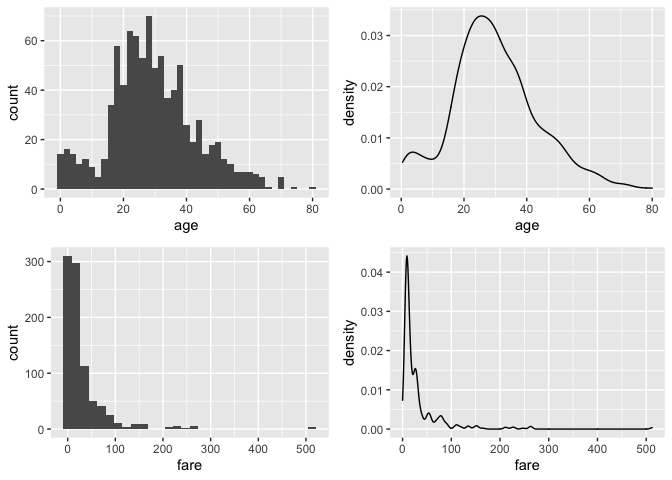<!-- -->

```r
#age is close to normal except more newborns/toddlers and fewer teens than expected 
#perhaps fare could be modeled with a log-normal or gamma distrubition; notice a couple fares > $500


#Bivariate
#categorical-continuous
ggplot(data=f_titanic) +
  geom_boxplot(aes(pclass,age))
```

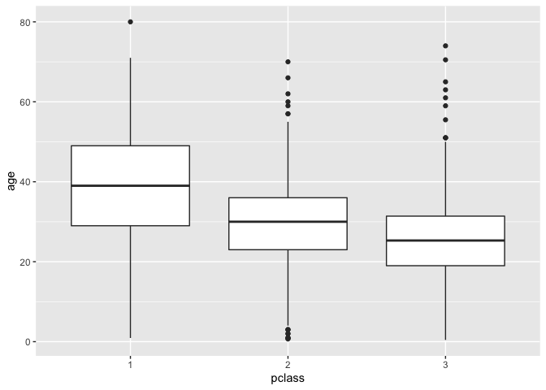<!-- -->

```r
 #age by pclass: age tends to decrease as pclass increases

#categorical/integer-continuous or cotinuous-continuous
ggplot(data=f_titanic)+geom_point(aes(age,fare),method="lm") #fare outliers (>$500) for two people just shy of 40 yo; no obvious relationship here
```

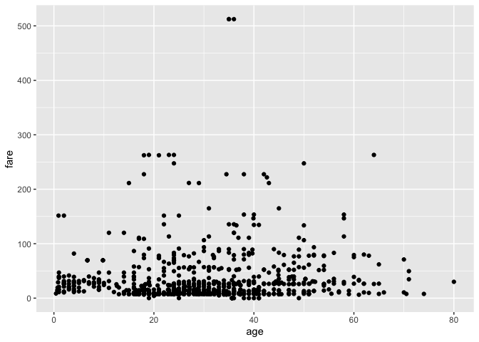<!-- -->

```r
f_titanic %>% filter(fare<500) %>% ggplot()+geom_point(aes(age,fare))+geom_smooth(aes(age,fare),method="lm") #here it is without the high fares
```

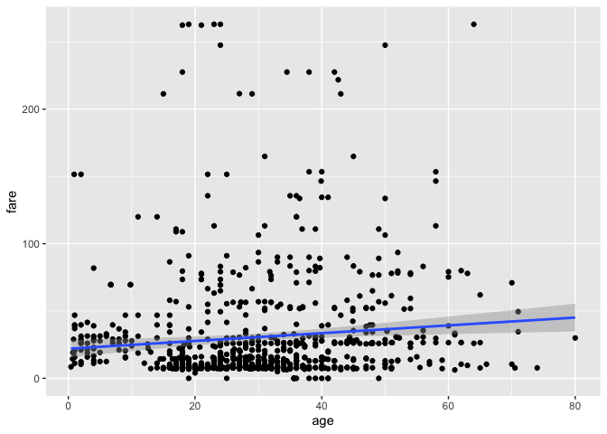<!-- -->

```r
f_titanic %>% filter(fare>500)
```

```
## # A tibble: 3 x 11
##   survived passenger_id pclass sex     age  fare embarked cabin_type ticket_cat
##   <fct>           <int> <fct>  <fct> <dbl> <dbl> <fct>    <fct>      <fct>     
## 1 1                 259 1      fema…    35  512. C        UO         P         
## 2 1                 680 1      male     36  512. C        B          P         
## 3 1                 738 1      male     35  512. C        B          P         
## # … with 2 more variables: marital_status <fct>, fam_size <fct>
```

```r
ggplot(data=f_titanic)+geom_point(aes(age,fare,color=pclass)) 
```

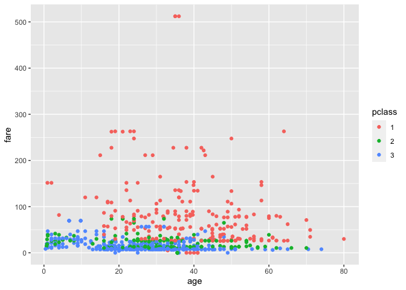<!-- -->

```r
#lower class passengers generally had lower ticket fares at each age
ggplot(data=f_titanic,aes(fare,..density..))+geom_freqpoly()+facet_wrap(~ fam_size) 
```

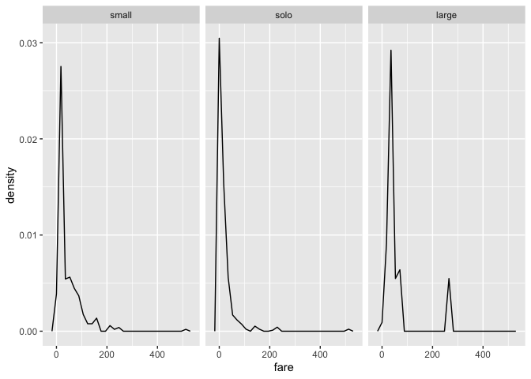<!-- -->

```r
#similar pattern among all fam_size levels (peaks at very low fare) except that small fam_size indicates a smaller peak and more observations at fares <200
ggplot(data=f_titanic,aes(fare,..density..))+geom_freqpoly(aes(color=embarked))
```

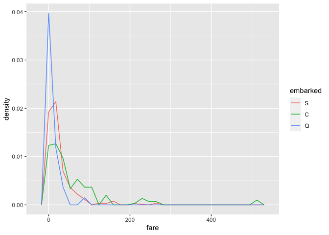<!-- -->

```r
#Predictors and dependent variable (survived)
#categorical-continuous
s1<-ggplot(data=f_titanic,aes(age,..density..)) + 
  geom_freqpoly(aes(color=survived)) +
  theme(legend.position="bottom") #similar pattern in age distrubtion by survival
s2<-ggplot(f_titanic,aes(survived,age)) +
  stat_summary(geom="bar",fill="steelblue") +
  stat_summary(geom="errorbar")
s3<-ggplot(data=f_titanic,aes(fare,..density..)) + 
  geom_freqpoly(aes(color=survived)) +
  theme(legend.position="bottom") #similar to age
s4<-ggplot(f_titanic,aes(survived,fare)) +
  stat_summary(geom="bar",fill="steelblue") +
  stat_summary(geom="errorbar")
plot_grid(s1,s2,s3,s4,ncol=2)
```

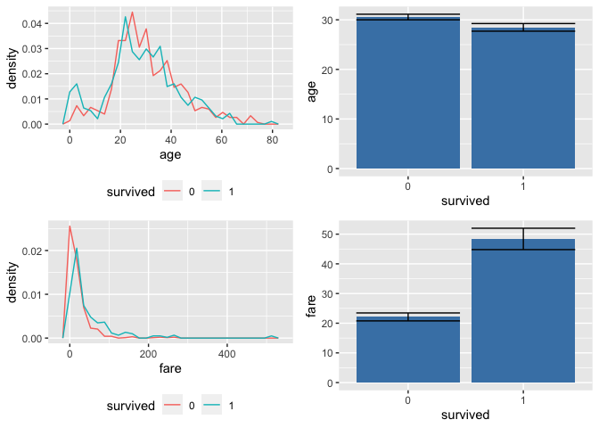<!-- -->

```r
#without high fares
f_titanic %>%
  filter(fare<=500) %>%
  ggplot(aes(survived,fare)) +
  stat_summary(geom="bar",fill="steelblue") +
  stat_summary(geom="errorbar")
```

<!-- -->

```r
#TABLE
survived_pclass_table<-
  f_titanic %>%
  group_by(survived,pclass) %>%
  summarize(
    N=n(),
    .groups="drop"
  )
survived_pclass_table
```

```
## # A tibble: 6 x 3
##   survived pclass     N
##   <fct>    <fct>  <int>
## 1 0        1         80
## 2 0        2         97
## 3 0        3        372
## 4 1        1        136
## 5 1        2         87
## 6 1        3        119
```

```r
kable(survived_pclass_table,format="html") %>%
  kable_styling("striped","bordered") %>%
  add_header_above(c(" "=1,"Passenger survival by pclass"=2)) #title spans cols 2 and 3
```

<table class="table table-striped" style="margin-left: auto; margin-right: auto;">
 <thead>
<tr>
<th style="empty-cells: hide;border-bottom:hidden;" colspan="1"></th>
<th style="border-bottom:hidden;padding-bottom:0; padding-left:3px;padding-right:3px;text-align: center; " colspan="2"><div style="border-bottom: 1px solid #ddd; padding-bottom: 5px; ">Passenger survival by pclass</div></th>
</tr>
  <tr>
   <th style="text-align:left;"> survived </th>
   <th style="text-align:left;"> pclass </th>
   <th style="text-align:right;"> N </th>
  </tr>
 </thead>
<tbody>
  <tr>
   <td style="text-align:left;"> 0 </td>
   <td style="text-align:left;"> 1 </td>
   <td style="text-align:right;"> 80 </td>
  </tr>
  <tr>
   <td style="text-align:left;"> 0 </td>
   <td style="text-align:left;"> 2 </td>
   <td style="text-align:right;"> 97 </td>
  </tr>
  <tr>
   <td style="text-align:left;"> 0 </td>
   <td style="text-align:left;"> 3 </td>
   <td style="text-align:right;"> 372 </td>
  </tr>
  <tr>
   <td style="text-align:left;"> 1 </td>
   <td style="text-align:left;"> 1 </td>
   <td style="text-align:right;"> 136 </td>
  </tr>
  <tr>
   <td style="text-align:left;"> 1 </td>
   <td style="text-align:left;"> 2 </td>
   <td style="text-align:right;"> 87 </td>
  </tr>
  <tr>
   <td style="text-align:left;"> 1 </td>
   <td style="text-align:left;"> 3 </td>
   <td style="text-align:right;"> 119 </td>
  </tr>
</tbody>
</table>
\
\

### Preprocessing Test Data

```r
#Read in data
t_titanic<-read_csv(here("data","raw_data","test.csv"),
                    col_types="ifcfniicncf")
t_titanic
```

```
## # A tibble: 418 x 11
##    PassengerId Pclass Name   Sex     Age SibSp Parch Ticket  Fare Cabin Embarked
##          <int> <fct>  <chr>  <fct> <dbl> <int> <int> <chr>  <dbl> <chr> <fct>   
##  1         892 3      Kelly… male   34.5     0     0 330911  7.83 <NA>  Q       
##  2         893 3      Wilke… fema…  47       1     0 363272  7    <NA>  S       
##  3         894 2      Myles… male   62       0     0 240276  9.69 <NA>  Q       
##  4         895 3      Wirz,… male   27       0     0 315154  8.66 <NA>  S       
##  5         896 3      Hirvo… fema…  22       1     1 31012… 12.3  <NA>  S       
##  6         897 3      Svens… male   14       0     0 7538    9.22 <NA>  S       
##  7         898 3      Conno… fema…  30       0     0 330972  7.63 <NA>  Q       
##  8         899 2      Caldw… male   26       1     1 248738 29    <NA>  S       
##  9         900 3      Abrah… fema…  18       0     0 2657    7.23 <NA>  C       
## 10         901 3      Davie… male   21       2     0 A/4 4… 24.2  <NA>  S       
## # … with 408 more rows
```

```r
#Clean data
#1. Preliminary data checking
nrow(t_titanic); ncol(t_titanic) #check # of rows/cols
```

```
## [1] 418
```

```
## [1] 11
```

```r
str(t_titanic) #check classes of variables
```

```
## tibble [418 × 11] (S3: spec_tbl_df/tbl_df/tbl/data.frame)
##  $ PassengerId: int [1:418] 892 893 894 895 896 897 898 899 900 901 ...
##  $ Pclass     : Factor w/ 3 levels "3","2","1": 1 1 2 1 1 1 1 2 1 1 ...
##  $ Name       : chr [1:418] "Kelly, Mr. James" "Wilkes, Mrs. James (Ellen Needs)" "Myles, Mr. Thomas Francis" "Wirz, Mr. Albert" ...
##  $ Sex        : Factor w/ 2 levels "male","female": 1 2 1 1 2 1 2 1 2 1 ...
##  $ Age        : num [1:418] 34.5 47 62 27 22 14 30 26 18 21 ...
##  $ SibSp      : int [1:418] 0 1 0 0 1 0 0 1 0 2 ...
##  $ Parch      : int [1:418] 0 0 0 0 1 0 0 1 0 0 ...
##  $ Ticket     : chr [1:418] "330911" "363272" "240276" "315154" ...
##  $ Fare       : num [1:418] 7.83 7 9.69 8.66 12.29 ...
##  $ Cabin      : chr [1:418] NA NA NA NA ...
##  $ Embarked   : Factor w/ 3 levels "Q","S","C": 1 2 1 2 2 2 1 2 3 2 ...
##  - attr(*, "spec")=
##   .. cols(
##   ..   PassengerId = col_integer(),
##   ..   Pclass = col_factor(levels = NULL, ordered = FALSE, include_na = FALSE),
##   ..   Name = col_character(),
##   ..   Sex = col_factor(levels = NULL, ordered = FALSE, include_na = FALSE),
##   ..   Age = col_number(),
##   ..   SibSp = col_integer(),
##   ..   Parch = col_integer(),
##   ..   Ticket = col_character(),
##   ..   Fare = col_number(),
##   ..   Cabin = col_character(),
##   ..   Embarked = col_factor(levels = NULL, ordered = FALSE, include_na = FALSE)
##   .. )
```

```r
head(t_titanic,n=10); tail(t_titanic,n=10) #check top/bottom of tibble
```

```
## # A tibble: 10 x 11
##    PassengerId Pclass Name   Sex     Age SibSp Parch Ticket  Fare Cabin Embarked
##          <int> <fct>  <chr>  <fct> <dbl> <int> <int> <chr>  <dbl> <chr> <fct>   
##  1         892 3      Kelly… male   34.5     0     0 330911  7.83 <NA>  Q       
##  2         893 3      Wilke… fema…  47       1     0 363272  7    <NA>  S       
##  3         894 2      Myles… male   62       0     0 240276  9.69 <NA>  Q       
##  4         895 3      Wirz,… male   27       0     0 315154  8.66 <NA>  S       
##  5         896 3      Hirvo… fema…  22       1     1 31012… 12.3  <NA>  S       
##  6         897 3      Svens… male   14       0     0 7538    9.22 <NA>  S       
##  7         898 3      Conno… fema…  30       0     0 330972  7.63 <NA>  Q       
##  8         899 2      Caldw… male   26       1     1 248738 29    <NA>  S       
##  9         900 3      Abrah… fema…  18       0     0 2657    7.23 <NA>  C       
## 10         901 3      Davie… male   21       2     0 A/4 4… 24.2  <NA>  S
```

```
## # A tibble: 10 x 11
##    PassengerId Pclass Name  Sex     Age SibSp Parch Ticket   Fare Cabin Embarked
##          <int> <fct>  <chr> <fct> <dbl> <int> <int> <chr>   <dbl> <chr> <fct>   
##  1        1300 3      "Rio… fema…  NA       0     0 334915   7.72 <NA>  Q       
##  2        1301 3      "Pea… fema…   3       1     1 SOTON…  13.8  <NA>  S       
##  3        1302 3      "Nau… fema…  NA       0     0 365237   7.75 <NA>  Q       
##  4        1303 1      "Min… fema…  37       1     0 19928   90    C78   Q       
##  5        1304 3      "Hen… fema…  28       0     0 347086   7.78 <NA>  S       
##  6        1305 3      "Spe… male   NA       0     0 A.5. …   8.05 <NA>  S       
##  7        1306 1      "Oli… fema…  39       0     0 PC 17… 109.   C105  C       
##  8        1307 3      "Sae… male   38.5     0     0 SOTON…   7.25 <NA>  S       
##  9        1308 3      "War… male   NA       0     0 359309   8.05 <NA>  S       
## 10        1309 3      "Pet… male   NA       1     1 2668    22.4  <NA>  C
```

```r
#2. Data cleaning
t_titanic<-clean_names(t_titanic) #clean names
#re-level factors to match training set
t_titanic$pclass<-fct_relevel(t_titanic$pclass,c("1","2","3"))
t_titanic$embarked<-fct_relevel(t_titanic$embarked,c("S","C","Q"))


#3. Data imputation
#assess missing data
vis_dat(t_titanic)
```

<!-- -->

```r
vis_miss(t_titanic)
```

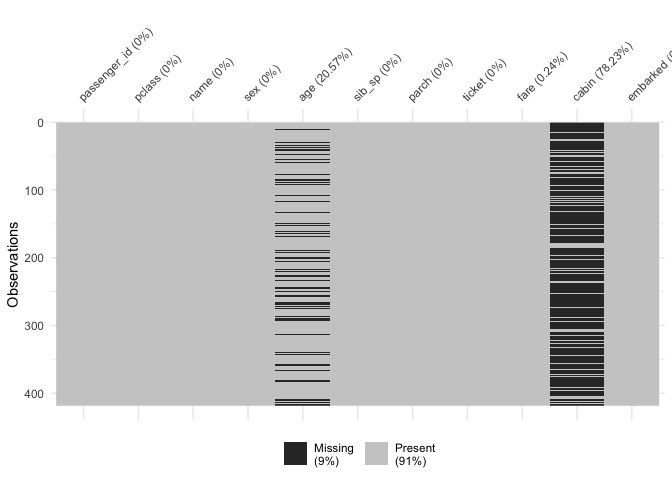<!-- -->

```r
#lots of cabin data missing, about 20% age data missing, and 1 fare data point missing

#impute data
t_titanic$cabin[is.na(t_titanic$cabin)]<-"unknown_other" #replace NAs with unknown_other
#use same preprocessing from training data
imputed<-readRDS(here("data","tidy_data","imputed_data_recipe"))
it_titanic<-prep(imputed) %>% bake(new_data=t_titanic)
summary(it_titanic) #no missing data
```

```
##  pclass      sex           age            sib_sp           parch       
##  1:107   male  :266   Min.   : 0.17   Min.   :0.0000   Min.   :0.0000  
##  2: 93   female:152   1st Qu.:22.00   1st Qu.:0.0000   1st Qu.:0.0000  
##  3:218                Median :28.00   Median :0.0000   Median :0.0000  
##                       Mean   :30.15   Mean   :0.4474   Mean   :0.3923  
##                       3rd Qu.:37.30   3rd Qu.:1.0000   3rd Qu.:0.0000  
##                       Max.   :76.00   Max.   :8.0000   Max.   :9.0000  
##       fare         embarked
##  Min.   :  0.000   S:270   
##  1st Qu.:  7.896   C:102   
##  Median : 14.454   Q: 46   
##  Mean   : 35.586           
##  3rd Qu.: 31.472           
##  Max.   :512.329
```

```r
ct_titanic<-bind_cols(t_titanic[,1],it_titanic[,1:7],t_titanic[,c(3,8,10)])


#4. Data checking
#check n's (using prior knowledge)
range(ct_titanic$age,na.rm=T) #0.17-76
```

```
## [1]  0.17 76.00
```

```r
range(ct_titanic$fare,na.rm=T) #0-512
```

```
## [1]   0.0000 512.3292
```

```r
range(ct_titanic$sib_sp) #0-8
```

```
## [1] 0 8
```

```r
range(ct_titanic$parch) #0-9
```

```
## [1] 0 9
```

```r
#all seem reasonable

#validate with external data
#from wiki: 24.6% 1st class; 21.5% 2nd class; and 53.8% 3rd class
tabyl(ct_titanic,pclass) #25.6%, 22.2%, and 52.1% (seem close)
```

```
##  pclass   n   percent
##       1 107 0.2559809
##       2  93 0.2224880
##       3 218 0.5215311
```

```r
#from wiki: 66% male and 34% female
tabyl(ct_titanic,sex) #63.6% m and 36.4% f (again, close)
```

```
##     sex   n   percent
##    male 266 0.6363636
##  female 152 0.3636364
```

```r
#data summaries (with imputed data)
summary(ct_titanic)
```

```
##   passenger_id    pclass      sex           age            sib_sp      
##  Min.   : 892.0   1:107   male  :266   Min.   : 0.17   Min.   :0.0000  
##  1st Qu.: 996.2   2: 93   female:152   1st Qu.:22.00   1st Qu.:0.0000  
##  Median :1100.5   3:218                Median :28.00   Median :0.0000  
##  Mean   :1100.5                        Mean   :30.15   Mean   :0.4474  
##  3rd Qu.:1204.8                        3rd Qu.:37.30   3rd Qu.:1.0000  
##  Max.   :1309.0                        Max.   :76.00   Max.   :8.0000  
##      parch             fare         embarked     name          
##  Min.   :0.0000   Min.   :  0.000   S:270    Length:418        
##  1st Qu.:0.0000   1st Qu.:  7.896   C:102    Class :character  
##  Median :0.0000   Median : 14.454   Q: 46    Mode  :character  
##  Mean   :0.3923   Mean   : 35.586                              
##  3rd Qu.:0.0000   3rd Qu.: 31.472                              
##  Max.   :9.0000   Max.   :512.329                              
##     ticket             cabin          
##  Length:418         Length:418        
##  Class :character   Class :character  
##  Mode  :character   Mode  :character  
##                                       
##                                       
## 
```

```r
skim(ct_titanic)
```


<table style='width: auto;'
        class='table table-condensed'>
<caption>Data summary</caption>
 <thead>
  <tr>
   <th style="text-align:left;">   </th>
   <th style="text-align:left;">   </th>
  </tr>
 </thead>
<tbody>
  <tr>
   <td style="text-align:left;"> Name </td>
   <td style="text-align:left;"> ct_titanic </td>
  </tr>
  <tr>
   <td style="text-align:left;"> Number of rows </td>
   <td style="text-align:left;"> 418 </td>
  </tr>
  <tr>
   <td style="text-align:left;"> Number of columns </td>
   <td style="text-align:left;"> 11 </td>
  </tr>
  <tr>
   <td style="text-align:left;"> _______________________ </td>
   <td style="text-align:left;">  </td>
  </tr>
  <tr>
   <td style="text-align:left;"> Column type frequency: </td>
   <td style="text-align:left;">  </td>
  </tr>
  <tr>
   <td style="text-align:left;"> character </td>
   <td style="text-align:left;"> 3 </td>
  </tr>
  <tr>
   <td style="text-align:left;"> factor </td>
   <td style="text-align:left;"> 3 </td>
  </tr>
  <tr>
   <td style="text-align:left;"> numeric </td>
   <td style="text-align:left;"> 5 </td>
  </tr>
  <tr>
   <td style="text-align:left;"> ________________________ </td>
   <td style="text-align:left;">  </td>
  </tr>
  <tr>
   <td style="text-align:left;"> Group variables </td>
   <td style="text-align:left;">  </td>
  </tr>
</tbody>
</table>


**Variable type: character**

<table>
 <thead>
  <tr>
   <th style="text-align:left;"> skim_variable </th>
   <th style="text-align:right;"> n_missing </th>
   <th style="text-align:right;"> complete_rate </th>
   <th style="text-align:right;"> min </th>
   <th style="text-align:right;"> max </th>
   <th style="text-align:right;"> empty </th>
   <th style="text-align:right;"> n_unique </th>
   <th style="text-align:right;"> whitespace </th>
  </tr>
 </thead>
<tbody>
  <tr>
   <td style="text-align:left;"> name </td>
   <td style="text-align:right;"> 0 </td>
   <td style="text-align:right;"> 1 </td>
   <td style="text-align:right;"> 13 </td>
   <td style="text-align:right;"> 63 </td>
   <td style="text-align:right;"> 0 </td>
   <td style="text-align:right;"> 418 </td>
   <td style="text-align:right;"> 0 </td>
  </tr>
  <tr>
   <td style="text-align:left;"> ticket </td>
   <td style="text-align:right;"> 0 </td>
   <td style="text-align:right;"> 1 </td>
   <td style="text-align:right;"> 3 </td>
   <td style="text-align:right;"> 18 </td>
   <td style="text-align:right;"> 0 </td>
   <td style="text-align:right;"> 363 </td>
   <td style="text-align:right;"> 0 </td>
  </tr>
  <tr>
   <td style="text-align:left;"> cabin </td>
   <td style="text-align:right;"> 0 </td>
   <td style="text-align:right;"> 1 </td>
   <td style="text-align:right;"> 1 </td>
   <td style="text-align:right;"> 15 </td>
   <td style="text-align:right;"> 0 </td>
   <td style="text-align:right;"> 77 </td>
   <td style="text-align:right;"> 0 </td>
  </tr>
</tbody>
</table>


**Variable type: factor**

<table>
 <thead>
  <tr>
   <th style="text-align:left;"> skim_variable </th>
   <th style="text-align:right;"> n_missing </th>
   <th style="text-align:right;"> complete_rate </th>
   <th style="text-align:left;"> ordered </th>
   <th style="text-align:right;"> n_unique </th>
   <th style="text-align:left;"> top_counts </th>
  </tr>
 </thead>
<tbody>
  <tr>
   <td style="text-align:left;"> pclass </td>
   <td style="text-align:right;"> 0 </td>
   <td style="text-align:right;"> 1 </td>
   <td style="text-align:left;"> FALSE </td>
   <td style="text-align:right;"> 3 </td>
   <td style="text-align:left;"> 3: 218, 1: 107, 2: 93 </td>
  </tr>
  <tr>
   <td style="text-align:left;"> sex </td>
   <td style="text-align:right;"> 0 </td>
   <td style="text-align:right;"> 1 </td>
   <td style="text-align:left;"> FALSE </td>
   <td style="text-align:right;"> 2 </td>
   <td style="text-align:left;"> mal: 266, fem: 152 </td>
  </tr>
  <tr>
   <td style="text-align:left;"> embarked </td>
   <td style="text-align:right;"> 0 </td>
   <td style="text-align:right;"> 1 </td>
   <td style="text-align:left;"> FALSE </td>
   <td style="text-align:right;"> 3 </td>
   <td style="text-align:left;"> S: 270, C: 102, Q: 46 </td>
  </tr>
</tbody>
</table>


**Variable type: numeric**

<table>
 <thead>
  <tr>
   <th style="text-align:left;"> skim_variable </th>
   <th style="text-align:right;"> n_missing </th>
   <th style="text-align:right;"> complete_rate </th>
   <th style="text-align:right;"> mean </th>
   <th style="text-align:right;"> sd </th>
   <th style="text-align:right;"> p0 </th>
   <th style="text-align:right;"> p25 </th>
   <th style="text-align:right;"> p50 </th>
   <th style="text-align:right;"> p75 </th>
   <th style="text-align:right;"> p100 </th>
   <th style="text-align:left;"> hist </th>
  </tr>
 </thead>
<tbody>
  <tr>
   <td style="text-align:left;"> passenger_id </td>
   <td style="text-align:right;"> 0 </td>
   <td style="text-align:right;"> 1 </td>
   <td style="text-align:right;"> 1100.50 </td>
   <td style="text-align:right;"> 120.81 </td>
   <td style="text-align:right;"> 892.00 </td>
   <td style="text-align:right;"> 996.25 </td>
   <td style="text-align:right;"> 1100.50 </td>
   <td style="text-align:right;"> 1204.75 </td>
   <td style="text-align:right;"> 1309.00 </td>
   <td style="text-align:left;"> ▇▇▇▇▇ </td>
  </tr>
  <tr>
   <td style="text-align:left;"> age </td>
   <td style="text-align:right;"> 0 </td>
   <td style="text-align:right;"> 1 </td>
   <td style="text-align:right;"> 30.15 </td>
   <td style="text-align:right;"> 13.12 </td>
   <td style="text-align:right;"> 0.17 </td>
   <td style="text-align:right;"> 22.00 </td>
   <td style="text-align:right;"> 28.00 </td>
   <td style="text-align:right;"> 37.30 </td>
   <td style="text-align:right;"> 76.00 </td>
   <td style="text-align:left;"> ▁▇▅▂▁ </td>
  </tr>
  <tr>
   <td style="text-align:left;"> sib_sp </td>
   <td style="text-align:right;"> 0 </td>
   <td style="text-align:right;"> 1 </td>
   <td style="text-align:right;"> 0.45 </td>
   <td style="text-align:right;"> 0.90 </td>
   <td style="text-align:right;"> 0.00 </td>
   <td style="text-align:right;"> 0.00 </td>
   <td style="text-align:right;"> 0.00 </td>
   <td style="text-align:right;"> 1.00 </td>
   <td style="text-align:right;"> 8.00 </td>
   <td style="text-align:left;"> ▇▁▁▁▁ </td>
  </tr>
  <tr>
   <td style="text-align:left;"> parch </td>
   <td style="text-align:right;"> 0 </td>
   <td style="text-align:right;"> 1 </td>
   <td style="text-align:right;"> 0.39 </td>
   <td style="text-align:right;"> 0.98 </td>
   <td style="text-align:right;"> 0.00 </td>
   <td style="text-align:right;"> 0.00 </td>
   <td style="text-align:right;"> 0.00 </td>
   <td style="text-align:right;"> 0.00 </td>
   <td style="text-align:right;"> 9.00 </td>
   <td style="text-align:left;"> ▇▁▁▁▁ </td>
  </tr>
  <tr>
   <td style="text-align:left;"> fare </td>
   <td style="text-align:right;"> 0 </td>
   <td style="text-align:right;"> 1 </td>
   <td style="text-align:right;"> 35.59 </td>
   <td style="text-align:right;"> 55.85 </td>
   <td style="text-align:right;"> 0.00 </td>
   <td style="text-align:right;"> 7.90 </td>
   <td style="text-align:right;"> 14.45 </td>
   <td style="text-align:right;"> 31.47 </td>
   <td style="text-align:right;"> 512.33 </td>
   <td style="text-align:left;"> ▇▁▁▁▁ </td>
  </tr>
</tbody>
</table>

```r
#5. Feature engineering
#cabin: code as factor
head(sort(ct_titanic$cabin),n=15) #sample of sorted cabin values
```

```
##  [1] "A11" "A18" "A21" "A29" "A34" "A34" "A9"  "B10" "B11" "B24" "B26" "B36"
## [13] "B41" "B45" "B45"
```

```r
length(unique(ct_titanic$cabin)) #77 different cabin types
```

```
## [1] 77
```

```r
ct_titanic$cabin[str_which(ct_titanic$cabin,"^T|^G")]<-"unknown_other" 
#replaces T & G cabinswith u_o (few numbers)

#bin cabin names by first letter into types
ct_titanic<-ct_titanic %>%
  mutate(cabin_type=case_when(
    str_detect(cabin,"^A")~"A",
    str_detect(cabin,"^B")~"B",
    str_detect(cabin,"^C")~"C",
    str_detect(cabin,"^D")~"D",
    str_detect(cabin,"^E")~"E",
    str_detect(cabin,"^F")~"F",
    str_detect(cabin,"unknown_other")~"UO"
  )) 
tail(ct_titanic[,11:12],10) #check, and it works
```

```
## # A tibble: 10 x 2
##    cabin         cabin_type
##    <chr>         <chr>     
##  1 unknown_other UO        
##  2 unknown_other UO        
##  3 unknown_other UO        
##  4 C78           C         
##  5 unknown_other UO        
##  6 unknown_other UO        
##  7 C105          C         
##  8 unknown_other UO        
##  9 unknown_other UO        
## 10 unknown_other UO
```

```r
sum(is.na(ct_titanic$cabin_type)) #0; no NAs
```

```
## [1] 0
```

```r
ct_titanic$cabin_type<-as.factor(ct_titanic$cabin_type) #makes it a factor
levels(ct_titanic$cabin_type) #7 levels
```

```
## [1] "A"  "B"  "C"  "D"  "E"  "F"  "UO"
```

```r
#tickets: code as factor
#bin tickets into categories (as a factor)
head(sort(ct_titanic$ticket),n=20) #sample of sorted tickets by character
```

```
##  [1] "110469" "110489" "110813" "111163" "112051" "112058" "112377" "112378"
##  [9] "112378" "112901" "113038" "113044" "113054" "113059" "113503" "113503"
## [17] "113503" "113503" "113509" "113773"
```

```r
head(sort(as.numeric(ct_titanic$ticket)),n=20) #sample of sorted tickets by number
```

```
##  [1]  680  694 1222 1601 2003 2543 2621 2622 2625 2650 2650 2652 2653 2654 2655
## [16] 2656 2657 2658 2660 2660
```

```r
ct_titanic$ticket<-
  str_replace_all(ct_titanic$ticket,"[[:punct:]]","") #removes punctuation

#bins ticket prefixes into categories
ct_titanic<-ct_titanic %>% 
  mutate(ticket_cat=case_when(
    as.numeric(ticket)<10000~"under_10k",
    between(as.numeric(ticket),10000,100000)~"10k_up",
    between(as.numeric(ticket),100000,200000)~"100k",
    between(as.numeric(ticket),200000,300000)~"200k",
    between(as.numeric(ticket),300000,1000000)~"300k",
    as.numeric(ticket)>1000000~"mil",
    str_detect(ticket,"^A")~"A",
    str_detect(ticket,"^C")~"C",
    str_detect(ticket,"^P")~"P",
    str_detect(ticket,"^SC")~"SC",
    str_detect(ticket,"^SOT")~"SOT",
    str_detect(ticket,"^S(TO)")~"STO",
    str_detect(ticket,"^SO(C|P)")~"other",
    str_detect(ticket,"^W|^F|^L|^SP|^SW")~"other"
  )) 
unique(ct_titanic$ticket_cat)
```

```
##  [1] "300k"      "200k"      "mil"       "under_10k" "A"         "10k_up"   
##  [7] "other"     "SC"        "STO"       "P"         "C"         "100k"     
## [13] "SOT"
```

```r
sum(is.na(ct_titanic$ticket_cat)) #0; no NAs
```

```
## [1] 0
```

```r
ct_titanic$ticket_cat<-as.factor(ct_titanic$ticket_cat) #makes it a factor
levels(ct_titanic$ticket_cat)<-c("under_10k",
                                 "10k_up",
                                 "100k",
                                 "200k",
                                 "300k",
                                 "mil",
                                 "A",
                                 "C",
                                 "P",
                                 "SC",
                                 "SOT",
                                 "STO",
                                 "other")
levels(ct_titanic$ticket_cat)
```

```
##  [1] "under_10k" "10k_up"    "100k"      "200k"      "300k"      "mil"      
##  [7] "A"         "C"         "P"         "SC"        "SOT"       "STO"      
## [13] "other"
```

```r
#marital status: extract fromm name variable 
#variable creation (for marital status): unk_na=male & unk f; Fm=married female; Fum: unmarried female
ct_titanic<-ct_titanic %>%
  mutate(marital_status=case_when(
    sex=="male"~"unk_na",
    str_detect(name,"Mrs\\.|Mme\\.|Lady\\.(.*)Mrs")~"Fm",
    sex=="female" & str_detect(name,"Dr\\.")~"unk_na",
    str_detect(name,"Countess\\.|Ms.|Dona\\.")~"unk_na",
    str_detect(name,"Miss\\.|Mlle\\.")~"Fum"
  ))

unique(ct_titanic$marital_status) #3 categories
```

```
## [1] "unk_na" "Fm"     "Fum"
```

```r
sum(is.na(ct_titanic$marital_status)) #0; no NAs
```

```
## [1] 0
```

```r
ct_titanic$marital_status<-as.factor(ct_titanic$marital_status) #makes it a factor
levels(ct_titanic$marital_status) #same 3 categories
```

```
## [1] "Fm"     "Fum"    "unk_na"
```

```r
tabyl(ct_titanic$marital_status)
```

```
##  ct_titanic$marital_status   n   percent
##                         Fm  72 0.1722488
##                        Fum  78 0.1866029
##                     unk_na 268 0.6411483
```

```r
#family size: combine parch and sib_sp
ct_titanic<-ct_titanic %>% mutate(fam_size=parch+sib_sp)
ct_titanic$fam_size<-as.factor(ct_titanic$fam_size)
ct_titanic$fam_size<-fct_collapse(ct_titanic$fam_size,solo="0",small=c("1","2","3"),
                                 large=c("4","5","6","7","8","9","10","11","12","13","14","15","16","17",
                                         "18","19","20"))


#remove unnecessary columns and convert to ft_titanic
ct_titanic
```

```
## # A tibble: 418 x 15
##    passenger_id pclass sex     age sib_sp parch  fare embarked name  ticket
##           <int> <fct>  <fct> <dbl>  <int> <int> <dbl> <fct>    <chr> <chr> 
##  1          892 3      male   34.5      0     0  7.83 Q        Kell… 330911
##  2          893 3      fema…  47        1     0  7    S        Wilk… 363272
##  3          894 2      male   62        0     0  9.69 Q        Myle… 240276
##  4          895 3      male   27        0     0  8.66 S        Wirz… 315154
##  5          896 3      fema…  22        1     1 12.3  S        Hirv… 31012…
##  6          897 3      male   14        0     0  9.22 S        Sven… 7538  
##  7          898 3      fema…  30        0     0  7.63 Q        Conn… 330972
##  8          899 2      male   26        1     1 29    S        Cald… 248738
##  9          900 3      fema…  18        0     0  7.23 C        Abra… 2657  
## 10          901 3      male   21        2     0 24.2  S        Davi… A4 48…
## # … with 408 more rows, and 5 more variables: cabin <chr>, cabin_type <fct>,
## #   ticket_cat <fct>, marital_status <fct>, fam_size <fct>
```

```r
ft_titanic<-ct_titanic[,-c(5:6,9:11)] #removes sib_sp, parch, name, ticket, and cabin
ft_titanic
```

```
## # A tibble: 418 x 10
##    passenger_id pclass sex     age  fare embarked cabin_type ticket_cat
##           <int> <fct>  <fct> <dbl> <dbl> <fct>    <fct>      <fct>     
##  1          892 3      male   34.5  7.83 Q        UO         200k      
##  2          893 3      fema…  47    7    S        UO         200k      
##  3          894 2      male   62    9.69 Q        UO         100k      
##  4          895 3      male   27    8.66 S        UO         200k      
##  5          896 3      fema…  22   12.3  S        UO         A         
##  6          897 3      male   14    9.22 S        UO         other     
##  7          898 3      fema…  30    7.63 Q        UO         200k      
##  8          899 2      male   26   29    S        UO         100k      
##  9          900 3      fema…  18    7.23 C        UO         other     
## 10          901 3      male   21   24.2  S        UO         300k      
## # … with 408 more rows, and 2 more variables: marital_status <fct>,
## #   fam_size <fct>
```


